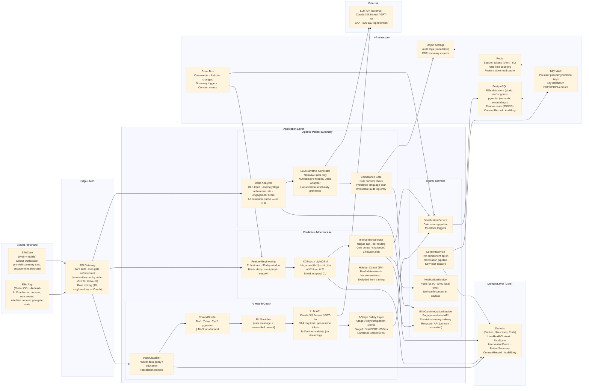
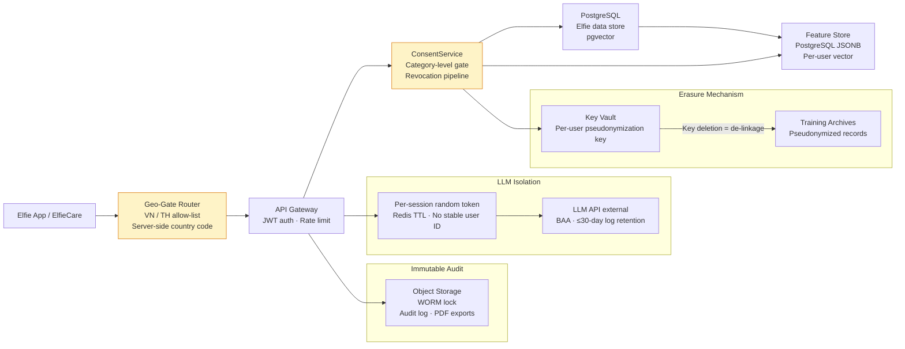

# AI Continuity Loop

## I. Phân tích vấn đề — Tại sao Elfie cần AI Continuity Loop

Elfie đã thu thập vitals, nhật ký thuốc, dữ liệu wearable và kết quả xét nghiệm từ hàng triệu bệnh nhân mắc bệnh mãn tính tại hơn 30 quốc gia. Dữ liệu đã có; hạ tầng đã có. Điều còn thiếu là một **vòng lặp khép kín** biến dữ liệu đó thành sự hiểu biết cho bệnh nhân, dùng dữ liệu đó để dự đoán và ngăn chặn bỏ điều trị, và chuyển dữ liệu thực tế đến tay bác sĩ điều trị trước mỗi lần tái khám — hoàn toàn tự động, không cần thao tác thủ công từ cả hai phía. Ba tính năng riêng lẻ hữu ích sẽ trở thành một bánh đà cộng hưởng khi chúng chia sẻ cùng một pipeline dữ liệu và củng cố lẫn nhau: AI Health Coach tạo ra tương tác hàng ngày → Predictive Adherence AI duy trì tương tác đó → Agentic Patient Summary chuyển hóa tương tác thành giá trị lâm sàng.

### Yêu cầu cốt lõi

- **AI Health Coach:** hỏi đáp ngôn ngữ tự nhiên dựa trên dữ liệu Elfie của chính người dùng; lớp an toàn 2 tầng (rule-based + ML classifier) chặn các đầu ra chẩn đoán hoặc hướng dẫn thuốc; truy xuất ngữ cảnh phân tầng (7 ngày gần nhất + semantic 90 ngày + toàn lịch sử theo yêu cầu); HIPAA BAA với nhà cung cấp LLM; hard escalation trigger cho các chỉ số nguy hiểm đến tính mạng; miễn phí cho tất cả người dùng; geo-gate VN + TH ở MVP
- **Predictive Adherence AI:** chấm điểm batch hàng ngày bằng XGBoost/LightGBM cho tất cả người dùng đang hoạt động trên 11 đặc trưng hành vi; đầu ra `risk_score` (0–1) + `risk_tier` (Low / Medium / High); intervention selector phân tầng rủi ro (nudge gamification → cảnh báo bác sĩ ElfieCare); 5% holdout cohort để đo tác động; xóa dữ liệu theo cơ chế key vault; kiểm toán bias hàng quý theo nhân khẩu học; geo-gate VN + TH
- **Agentic Patient Summary:** tổng hợp dữ liệu 30 ngày giữa các lần khám gửi vào ElfieCare trước mỗi buổi tái khám; application layer render toàn bộ giá trị định lượng (đầu ra Delta Analyzer — LLM không bao giờ thấy số liệu); LLM chỉ điền các slot văn bản tường thuật; đồng thuận kép (bệnh nhân chi tiết + bác sĩ xác nhận); compliance gate quét mọi đầu ra LLM trước khi gửi; thu hồi đồng thuận xóa tất cả summary đang chờ trong vòng 24 giờ; geo-gate VN + TH
- **Xuyên suốt các thành phần:** đồng thuận opt-in rõ ràng cho từng thành phần; lọc PII trước mọi lệnh gọi LLM; tuân thủ PDPD (Việt Nam) + PDPA (Thái Lan); nhật ký kiểm toán bất biến; tích hợp coin gamification xuyên suốt cả ba; xác nhận phụ thuộc cross-team ElfieCare trước khi lên kế hoạch

### Giả định

- Tệp người dùng Elfie đang hoạt động: Việt Nam + Thái Lan; ~50.000+ người dùng tích cực có hồ sơ bệnh mãn tính đủ điều kiện chấm điểm khi ra mắt MVP
- Dataset sự kiện coin Elfie: 3 tỷ+ sự kiện lịch sử dùng để huấn luyện; sự kiện mới phát sinh hàng ngày
- Cross-team ElfieCare: nhóm kỹ thuật cam kết năng lực cho 9 deliverable ElfieCare (4 từ Component 2, 5 từ Component 3) trước P1-G0 của mỗi thành phần
- Nhà cung cấp LLM: Claude 3.5 Sonnet hoặc GPT-4o; HIPAA BAA đã ký trước khi bất kỳ PHI nào được truyền đến API
- Hạ tầng: PostgreSQL sẵn có + extension pgvector cho embeddings; Redis cho sessions, rate-limiting và feature store; không cần GPU ở MVP (XGBoost batch scoring, DistilBERT-class inference chạy được trên CPU)
- Quy định: cả ba thành phần đều là Non-device CDS (công cụ hỗ trợ quyết định lâm sàng, không phải SaMD); Medical Affairs phải ký duyệt toàn bộ nội dung hướng đến người dùng và system prompt LLM trước khi ra mắt; mở rộng sang EU / US bị chặn chờ AI Act và FDA review

## II. Tài liệu thiết kế — tóm tắt hướng tiếp cận

**Tóm tắt ngắn (≤600 từ)**

Hướng tiếp cận cốt lõi: một pipeline event-driven gồm ba thành phần chia sẻ cùng một data store Elfie, mô hình đồng thuận và hạ tầng gamification. Mỗi thành phần có thể triển khai độc lập nhưng được thiết kế để khuếch đại lẫn nhau.

**AI Health Coach** là một conversational layer được điều phối qua API. Tin nhắn người dùng đi qua intent classifier, tiered context builder (Tier 1: 7 ngày gần nhất, Tier 2: semantic retrieval pgvector đến 90 ngày, Tier 3: toàn lịch sử theo yêu cầu) và PII scrubber trước khi đến LLM API. Toàn bộ phản hồi LLM được buffer lại, chạy qua 2-stage safety classifier (Stage 1: rule-based keyword/pattern ≤50ms; Stage 2: DistilBERT-class ML classifier ≤350ms), rồi mới gửi đến người dùng. Streaming được dời sang v2 vì SSE không tương thích về kiến trúc với kiểm tra an toàn sau khi sinh. Hard escalation trigger (HA >180/120, glucose <60 hoặc >400, đau ngực + khó thở) chặn hoàn toàn phản hồi AI và gửi thông điệp an toàn được mã hóa cứng.

**Predictive Adherence AI** là pipeline batch chạy hàng đêm. Feature engineering chạy trên cửa sổ hành vi 30 ngày (11 đặc trưng mỗi người dùng) từ event log Elfie, ghi vào feature store theo người dùng (Postgres JSONB), và chấm điểm toàn bộ người dùng đủ điều kiện qua XGBoost/LightGBM. Đầu ra (`risk_score`, `risk_tier`) được ghi vào intervention queue. Intervention selector áp dụng fatigue cap, kiểm tra liên kết bác sĩ và chấp nhận ToS, rồi gửi push notification, in-app card hoặc ElfieCare engagement alert card. 5% holdout cohort xác định theo hash không nhận can thiệp nào và bị loại khỏi quá trình huấn luyện — đây là phương tiện đo tác động kinh doanh chính. Huấn luyện lại theo quý offline.

**Agentic Patient Summary** là pipeline theo từng cặp bác sĩ-bệnh nhân, được kích hoạt thủ công bởi bác sĩ trong ElfieCare hoặc theo lịch 30 ngày cho các liên kết đồng thuận đang hoạt động. Delta Analyzer tính toán hướng xu hướng định lượng (OLS slope), cờ anomaly, tỷ lệ tuân thủ và điểm tương tác hoàn toàn trong application code — không có sự tham gia của LLM trong tính toán số liệu. LLM chỉ nhận các slot văn bản tường thuật có tên để điền vào một template cố định. Compliance Gate xác minh đồng thuận kép, quét đầu ra LLM tìm ngôn ngữ giải thích lâm sàng bị cấm, và tạo mục nhật ký kiểm toán bất biến trước khi gửi. Tất cả trường định lượng trong card hiển thị cho bác sĩ đều được render trực tiếp từ đầu ra Delta Analyzer; LLM không thể bịa đặt số liệu trong các phần có cấu trúc.

Build vs Buy (nguyên tắc): tự xây dựng toàn bộ pipeline tiếp xúc dữ liệu bệnh nhân và lớp an toàn — đây là lợi thế cạnh tranh của sản phẩm. Mua hoặc dùng open-source cho hạ tầng phổ thông: LLM API, DistilBERT open-source weights, XGBoost/LightGBM, pgvector extension, Redis.

Triển khai đa thành phần: cả ba thành phần chia sẻ cùng một user identity, hạ tầng đồng thuận, gamification pipeline và geo-gate enforcement. Event bus (Postgres LISTEN/NOTIFY hoặc message queue nhẹ) kết nối các thành phần: conversation milestone của AI Coach phát coin events; thay đổi risk-tier của Predictive AI có thể kích hoạt làm giàu ngữ cảnh cho Coach; pipeline Agentic Patient Summary đọc từ cùng Elfie data store mà context builder của Coach sử dụng.

Mô hình quyền riêng tư dữ liệu: mặc định là tiếp xúc LLM tối thiểu — chỉ Tier 1 context trừ khi người dùng yêu cầu lịch sử sâu hơn; random token theo phiên (không phải user ID) trong tất cả lệnh gọi LLM API; PII scrubber chạy hai lần (tin nhắn người dùng + assembled prompt); không huấn luyện model trên dữ liệu khách hàng; HIPAA BAA với nhà cung cấp LLM bắt buộc trước khi xử lý bất kỳ PHI nào; xóa dữ liệu huấn luyện Predictive AI qua cơ chế key vault.

Chi tiết thiết kế đầy đủ và sơ đồ ở phần dưới.

### 2.1 Sơ đồ hệ thống — mô tả để vẽ

#### Ghi chú cho sơ đồ Mermaid hệ thống (bao gồm các tầng Clean Architecture trong cùng một sơ đồ):
- Trên cùng/Interface: Clients (Elfie App iOS/Android, ElfieCare Web/Mobile) → API Gateway → Auth (JWT, quốc gia đăng ký người dùng cho geo-gate)
- Application layer: ba AI service (AICoachService, AdherenceAIService, PatientSummaryService), shared service (ConsentService, GamificationService, NotificationService, ElfieCareIntegrationService)
- Domain core: domain entity (UserHealthContext, RiskScore, InterventionEvent, PatientSummary, ConsentRecord) giữa tầng Application và Infrastructure
- Infrastructure: PostgreSQL (shared data store + pgvector), Redis (session token, feature store, rate-limit), LLM API (external, BAA-gated), EventBus, ObjectStorage (audit log)

#### Sơ đồ hệ thống

#### Chú giải phân cấp — Thành phần theo tầng

- **Interface (Clients)**
	- **Elfie App** (Flutter iOS + Android): giao diện chat AI Coach, luồng đồng thuận, coin events, bộ đếm rate-limit, trạng thái geo-gate, cài đặt quyền riêng tư.
	- **ElfieCare** (Web + Mobile): workspace bác sĩ; pre-visit summary card (Xem / Bỏ qua / Hoãn 7 ngày / Tạo lại), engagement alert card, luồng tái chấp nhận ToS của bác sĩ.

- **Application Layer**
	- *AI Health Coach*
		- **IntentClassifier**: phân loại tin nhắn người dùng sang các đường xử lý data-query, education hoặc escalation-needed.
		- **ContextBuilder**: tổng hợp ngữ cảnh phân tầng (Tier 1: 7 ngày gần nhất; Tier 2: cosine similarity pgvector, top-5 kết quả ≥0.75; Tier 3: toàn lịch sử theo yêu cầu chỉ khi có truy vấn thời gian rõ ràng).
		- **PII Scrubber**: lọc hai điểm — tin nhắn người dùng trước, assembled prompt sau — trước bất kỳ lệnh gọi LLM nào.
		- **LLM API client**: random token theo phiên; buffer toàn bộ phản hồi trước khi kiểm tra an toàn; không streaming.
		- **2-Stage Safety Layer**: Stage 1 khớp keyword/pattern xác định (≤50ms); Stage 2 DistilBERT-class classifier (≤350ms); ngân sách kết hợp ≤400ms P95; phản hồi không an toàn được viết lại, không bao giờ gửi đến người dùng.
	- *Predictive Adherence AI*
		- **Feature Engineering**: 11 đặc trưng hành vi trên cửa sổ 30 ngày; bắt buộc khoảng cách thời gian 7 ngày giữa ngày cắt đặc trưng T và điểm bắt đầu cửa sổ nhãn; batch hàng đêm.
		- **XGBoost / LightGBM**: AUC floor 0.72 (mục tiêu 0.78); 5-fold temporal CV; người dùng holdout cohort bị loại khỏi huấn luyện và đánh giá.
		- **InterventionSelector**: ánh xạ `risk_tier` → loại can thiệp; thực thi fatigue cap mỗi người dùng (tối đa 1 can thiệp mỗi 7 ngày mỗi kênh); chặn ElfieCare alert cho bác sĩ chưa tái chấp nhận ToS.
		- **Holdout Cohort (5%)**: xác định theo hash; được chấm điểm nhưng không bao giờ nhận can thiệp; phương tiện đo tác động chính.
	- *Agentic Patient Summary*
		- **Delta Analyzer**: tính hướng xu hướng OLS (↑/→/↓/Không đủ dữ liệu), cờ anomaly, tỷ lệ tuân thủ, điểm tương tác và điểm hoàn chỉnh dữ liệu theo metric — hoàn toàn trong application code.
		- **LLM Narrative Generator**: chỉ nhận phân loại xu hướng và vị trí slot tường thuật; tất cả giá trị số là literal do application layer điền sẵn trong template; LLM không thể viết số.
		- **Compliance Gate**: xác minh đồng thuận kép trước khi gửi; quét đầu ra LLM tìm ngôn ngữ lâm sàng bị cấm; tạo mục nhật ký kiểm toán bất biến với trường `system_prompt_version`; chặn gửi khi thiếu đồng thuận hoặc quét thất bại.
	- *Shared Services*
		- **ConsentService**: opt-in theo thành phần; toggle chi tiết theo danh mục mỗi cặp bác sĩ-bệnh nhân; pipeline thu hồi (SLA xóa 24h cho Patient Summary); cửa sổ tái đồng thuận khi consent stale (30 ngày); xóa key vault cho dữ liệu huấn luyện Predictive AI.
		- **GamificationService**: pipeline coin cho milestone AI Coach, bonus triggered bởi Predictive AI, phần thưởng cải thiện risk score.
		- **NotificationService**: lên lịch gửi theo múi giờ địa phương (08:00–20:00); không đưa nội dung sức khỏe vào push payload.
		- **ElfieCareIntegrationService**: gửi engagement alert với xác nhận delivery; push pre-visit summary; retraction API client.

- **Domain Layer (Core)**
	- **Entities, Use-cases, Ports**: `UserHealthContext`, `RiskScore`, `InterventionEvent`, `PatientSummary`, `ConsentRecord`, `AuditEntry`; business rule thuần túy không phụ thuộc infrastructure.

- **Infrastructure**
	- **PostgreSQL**: Elfie data store chung; pgvector extension cho semantic embedding; feature store (JSONB mỗi người dùng); bảng ConsentRecord và AuditLog.
	- **Redis**: token LLM theo phiên (short TTL); bộ đếm rate-limit; read cache feature store.
	- **Object Storage**: nhật ký kiểm toán bất biến; PDF summary export.
	- **Key Vault**: khóa pseudonymization mỗi người dùng cho bản ghi huấn luyện Predictive AI; xóa khóa thỏa mãn quyền xóa dữ liệu theo PDPD/PDPA mà không cần chạm vào training archive.
	- **Event Bus**: coin events, thay đổi risk-tier, summary trigger, consent event.

- **External**
	- **LLM API** (Claude 3.5 Sonnet / GPT-4o): HIPAA BAA bắt buộc trước khi truyền PHI; lưu giữ log API ≤30 ngày; random token theo phiên (không phải user ID) trong mỗi lệnh gọi.

#### Luồng dữ liệu (đánh số để chú thích):
1) Truy vấn người dùng → geo-gate API Gateway (allow-list VN/TH) → IntentClassifier → ContextBuilder → PII Scrubber → LLM API → 2-Stage Safety Layer → phản hồi được gửi (hoặc viết lại/chặn); coin event được phát lên Event Bus khi đạt milestone.
2) Batch đêm: Feature Engineering đọc Elfie event log → vector đặc trưng ghi vào feature store PostgreSQL → XGBoost/LightGBM chấm điểm toàn bộ người dùng đủ điều kiện → risk tier ghi vào intervention queue → InterventionSelector gửi can thiệp qua NotificationService hoặc ElfieCareIntegrationService.
3) Trigger summary (thủ công hoặc theo lịch): Delta Analyzer đọc dữ liệu Elfie cho cặp bác sĩ-bệnh nhân → Compliance Gate kiểm tra đồng thuận kép → LLM Narrative Generator điền slot tường thuật → Compliance Gate quét đầu ra → summary card đẩy vào ElfieCare qua ElfieCareIntegrationService → nhật ký kiểm toán bất biến ghi vào Object Storage.
4) Thu hồi đồng thuận: ConsentService đánh dấu consent bị thu hồi → xóa Key Vault (bản ghi huấn luyện Predictive AI) + gọi retraction API (Patient Summary) + xóa dữ liệu conversation AI Coach; tất cả trong SLA đã công bố (24h cho summary, 72h cho dữ liệu AI Coach).

#### Chú thích hình: "AI Continuity Loop — góc nhìn logic (clean architecture nhúng trong): interface → application (ba AI service + shared service) → domain → infrastructure; luồng dữ liệu event-driven, geo-gated, consent-governed và LLM-isolated."

### 2.2 Build vs Buy (bảng tóm tắt)

| Thành phần | Quyết định | Lý do |
|---|---:|---|
| AI Coach context builder + tiered retrieval | Tự xây | Cá nhân hóa trên data schema Elfie là lợi thế cạnh tranh cốt lõi |
| 2-stage safety layer (rule-based + classifier) | Tự xây (DistilBERT open source) | An toàn lâm sàng là yêu cầu bắt buộc; moderation có sẵn chưa được hiệu chỉnh cho lĩnh vực y tế |
| Predictive AI feature engineering pipeline | Tự xây | Thiết kế đặc trưng trên event schema độc quyền Elfie là data moat |
| Intervention selector + fatigue logic | Tự xây | Tích hợp gamification và logic can thiệp phân tầng là đặc thù sản phẩm |
| Delta Analyzer (tính toán summary số liệu) | Tự xây | Tính toán lâm sàng có cấu trúc phải xác định và kiểm toán được; không dùng vendor |
| Compliance Gate (kiểm tra đồng thuận + quét ngôn ngữ) | Tự xây | Kiểm tra đồng thuận kép là đặc thù sản phẩm; quét ngôn ngữ cần tinh chỉnh cho lĩnh vực y tế |
| LLM (conversational AI + narrative generation) | Mua (Claude 3.5 Sonnet / GPT-4o API) | Lý luận tổng quát đẳng cấp thế giới; BAA sẵn có; TTM nhanh hơn self-hosting |
| ML model training framework | Mua / open source (XGBoost, LightGBM) | ML tabular chuẩn ngành; không cần GPU; dễ audit |
| Vector search | Mua / extension (pgvector trên PostgreSQL sẵn có) | Tránh thêm vector DB riêng; tiết kiệm chi phí ở quy mô MVP |
| Session token store + rate limiting | Mua (Redis sẵn có) | Đã có trong hạ tầng Elfie; không thêm dependency mới |
| LLM safety classifier (base model) | Mua / open source (DistilBERT weights) | Base open-source; fine-tune in-house trên dữ liệu y tế |
| Key vault (cơ chế xóa dữ liệu) | Mua (cloud KMS hoặc HashiCorp Vault) | Vòng đời key được quản lý giảm rủi ro tuân thủ |
| Tính bất biến nhật ký kiểm toán | Mua (object storage với object lock) | WORM retention thỏa mãn yêu cầu kiểm toán PDPD/PDPA |

### 2.3 Kiến trúc cách ly dữ liệu & quyền riêng tư

#### Tóm tắt: application tier chung với phân quyền đồng thuận theo thành phần. PostgreSQL thực thi quyền truy cập dữ liệu theo hàng qua ConsentService — không thành phần nào đọc dữ liệu ngoài các danh mục người dùng đã bật. Lệnh gọi LLM API sử dụng random token theo phiên (không phải user identifier); ánh xạ token-to-user chỉ tồn tại trong Redis với TTL ngắn. Bản ghi huấn luyện Predictive AI được pseudonymize qua khóa ổn định mỗi người dùng lưu trong key vault; xóa khóa làm mất kết nối bản ghi vĩnh viễn mà không cần xóa khỏi training archive.

#### Cần vẽ gì cho cách ly dữ liệu:
- Hiển thị ConsentService là gateway giữa application service và PostgreSQL data store.
- Thêm icon khóa mỗi người dùng từ Key Vault chỉ vào training archive của Predictive AI.
- Hiển thị lệnh gọi LLM API truyền random session token, không phải user ID; Redis giữ ánh xạ.
- Hiển thị ghi nhật ký kiểm toán vào Object Storage với WORM lock.
- Hiển thị geo-gate router ở tầng API Gateway chặn request không phải VN/TH trước khi truy cập dữ liệu.

#### Sơ đồ cách ly dữ liệu (Mermaid)

#### Chú thích: "Truy cập dữ liệu qua consent-gate với LLM session token isolation, xóa dữ liệu qua key vault và WORM audit logging."

### 2.4 Chiến lược an toàn lâm sàng & AI guardrails

- **Kiến trúc an toàn 2 tầng cho AI Coach:** kiểm tra rule-based xác định (Stage 1) bắt ngay các pattern bị cấm rõ ràng; DistilBERT-class ML classifier (Stage 2) bắt các đầu ra không an toàn bị paraphrase hoặc drift ngữ nghĩa. Buffer-then-validate đảm bảo không có phản hồi một phần nào hiển thị cho người dùng trước khi cả hai stage thông qua. LLM chính bị loại hoàn toàn khỏi lớp an toàn — không dùng pattern LLM-đánh-giá-LLM.
- **Hard escalation trigger là hằng số bất biến trong code**, không phải tham số cấu hình: HA >180/120, glucose <60 hoặc >400 mg/dL, đau ngực + khó thở đồng thời. Thay đổi cần deploy code được review bởi chuyên gia y tế có chuyên môn.
- **LLM numerical isolation cho Patient Summary:** Delta Analyzer tạo ra toàn bộ giá trị định lượng; LLM chỉ nhận phân loại xu hướng (↑/→/↓/Không đủ dữ liệu), không nhận số liệu. Điều này làm cho hallucination số liệu trong các phần hiển thị cho bác sĩ không thể xảy ra về mặt cấu trúc, bất kể prompt engineering.
- **Kiểm soát phiên bản system prompt:** cập nhật system prompt cho cả AI Coach và Patient Summary đều cần chạy lại test suite compliance gate + ký duyệt Medical Affairs (≤5 ngày làm việc) + deploy qua code change. Auto-update bị cấm. Phiên bản system prompt được log theo từng conversation AI Coach và từng summary trong nhật ký kiểm toán.
- **Compliance Gate mỗi summary:** mọi lần tạo Patient Summary đều phải qua language scanner trước khi gửi. Nếu scanner thất bại hoặc thiếu đồng thuận, bác sĩ nhận được "Summary unavailable — please review patient record manually" — không bao giờ là summary một phần hoặc chưa có đồng thuận.
- **Validation gate của classifier:** Safety classifier (AI Coach Stage 2) phải đạt Precision ≥95%, Recall ≥90% trên dataset được chú thích độc lập (≥1.000 ví dụ, ≥2 người chú thích có nền tảng y tế, Cohen's kappa ≥0.80) trước khi bất kỳ người dùng thực nào thấy tính năng. Tái validation bắt buộc sau mỗi lần cập nhật classifier và hàng quý.
- **Định vị Non-device CDS:** cả ba thành phần được định vị là công cụ hiểu dữ liệu và hỗ trợ workflow, không phải SaMD. Toàn bộ nội dung hướng người dùng và ngôn ngữ marketing được Medical Affairs và Legal review trước khi ra mắt. "AI doctor", "medical AI" và "diagnosis" bị cấm trong mọi nội dung sản phẩm.

### 2.5 Cam kết quyền riêng tư dữ liệu

- **Không huấn luyện LLM trên dữ liệu bệnh nhân:** BAA quy định rõ không huấn luyện trên dữ liệu Elfie; lưu giữ log API ≤30 ngày hoặc zero-day retention. Model Predictive AI được huấn luyện trên bản ghi pseudonymize với bổ sung dữ liệu tổng hợp khi cần.
- **Cách ly token theo phiên:** mọi lệnh gọi LLM API đều dùng random token theo phiên được tạo mới mỗi conversation (không phải mỗi người dùng, không có nguồn gốc từ user ID). Ánh xạ token-to-user chỉ tồn tại trong Redis với TTL ngắn. Kể cả khi log LLM API bị truy xuất theo lệnh tư pháp, chúng cũng không thể liên kết với người dùng Elfie.
- **Lọc PII tại hai điểm:** tin nhắn người dùng và assembled context prompt đều qua PII scrubber trước khi đến LLM. Scrubber loại bỏ tên, địa chỉ, số ID và các định danh khác kể cả khi xuất hiện trong văn bản triệu chứng tự báo cáo.
- **Quyền xóa dữ liệu qua key vault (Predictive AI):** khóa pseudonymization ổn định mỗi người dùng lưu trong key vault; xóa khóa làm cho tất cả bản ghi huấn luyện pseudonymize không thể liên kết lại vĩnh viễn với người dùng — thỏa mãn PDPD (Việt Nam) Điều 11 / PDPA (Thái Lan) Mục 19 mà không cần xóa khỏi training archive. Chứng chỉ xóa được tạo khi xóa khóa.
- **SLA thu hồi đồng thuận:** Patient Summary — tất cả summary đang chờ và đã gửi nhưng chưa xem được xóa trong 24 giờ; dữ liệu conversation AI Coach — xóa toàn bộ store trong 72 giờ; mục nhật ký kiểm toán được tombstone (không xóa). Pipeline thu hồi tự động với đường leo thang force-deletion và runbook đã định nghĩa.
- **Đồng thuận chi tiết theo danh mục (Patient Summary):** bệnh nhân chọn danh mục dữ liệu nào bác sĩ được xem (vitals, tuân thủ thuốc, hoạt động thể chất, nhật ký triệu chứng, kết quả xét nghiệm, coin events). Mỗi danh mục có thể toggle độc lập. Đồng thuận là theo cặp bác sĩ-bệnh nhân, không phải toàn cục. Tái đồng thuận bắt buộc khi phiên bản văn bản đồng thuận thay đổi (cửa sổ 30 ngày trước khi xử lý như thu hồi).
- **Geo-gate là tuyến phòng thủ đầu tiên:** tất cả endpoint AI kiểm tra mã quốc gia đăng ký phía server theo allow-list VN/TH trước khi truy cập bất kỳ dữ liệu nào. Giới hạn theo địa chỉ IP không được dùng (dễ vượt qua và không liên quan với cư dân). Mở rộng allow-list cần legal review + cập nhật config + bản dịch nội dung trong cùng một release.

### 2.6 Mô hình chi phí — Free tier người dùng + monetize B2B

Triết lý định giá: tính năng AI Continuity Loop miễn phí cho tất cả người dùng Elfie App ở MVP — nhất quán với DNA "miễn phí cho tất cả" của Elfie. Monetize đến từ giá trị mang lại cho đối tác B2B (bảo hiểm, dược, cơ sở y tế), không phải từ việc thu phí bệnh nhân.

**Free tier (tất cả người dùng tiêu dùng, VN + TH):**
- AI Health Coach: 10 tin nhắn/ngày; toàn bộ lịch sử conversation được giữ lại; tất cả tính năng an toàn luôn bật
- Predictive Adherence AI: chấm điểm chạy ngầm; nudge gamification gửi qua coin/challenge engine hiện có; không có nhãn "AI" hiển thị ở cấp nudge
- Agentic Patient Summary: miễn phí cho bệnh nhân opt-in; miễn phí cho bác sĩ trong ElfieCare

**Premium tier người dùng (v2+, người dùng được bảo hiểm tài trợ):**
- Giới hạn tin nhắn AI Coach cao hơn (ví dụ: 30–50/ngày)
- Độ sâu ngữ cảnh nâng cao (toàn lịch sử luôn sẵn có)
- Ưu tiên trong hàng chờ tạo Patient Summary

**Tăng trưởng B2B (mô hình thương mại Elfie hiện có):**

| Loại đối tác | Giá trị AI Continuity Loop | Cơ chế thương mại |
|---|---|---|
| Bảo hiểm | Predictive AI giảm bỏ điều trị → ít bồi thường; Coach tăng tuân thủ → đo được kết quả | Hợp đồng dựa trên kết quả; phí tăng thêm per-member-per-month |
| Dược (ElfiePSP) | Tín hiệu tuân thủ + Patient Summary = tài sản real-world evidence | Phí thêm vào hợp đồng PSP; phí theo chương trình |
| Cơ sở y tế | Pre-visit Patient Summary tiết kiệm 5–10 phút/lần khám → 150h/bác sĩ/năm | ElfieCare enterprise tier; phí per-seat hoặc per-patient |
| Consortium ElfieData | Dataset có đồng thuận, longitudinal, đã gán nhãn (risk-scored) | Cấp phép dữ liệu ẩn danh cho consortium nghiên cứu |

**Ước tính chi phí LLM API (quy mô MVP):**
- AI Coach: TB 5 tin nhắn/user/ngày × 2.000 token/tin nhắn × giá Claude Sonnet ≈ $0,008/user/ngày; ở 10.000 DAU ≈ $80/ngày ($2.400/tháng)
- Patient Summary: ~1 summary/bệnh nhân/30 ngày × TB 3.000 token/summary ≈ $0,0048/summary; ở 5.000 summary/tháng ≈ $24/tháng
- Tổng chi phí LLM ở quy mô MVP: dưới $5.000/tháng; tăng tuyến tính theo DAU

## III. Kế hoạch nhóm & triển khai

Triển khai ba thành phần tuần tự theo rủi ro phụ thuộc, với Component 1 (AI Health Coach) trước (không có phụ thuộc cross-team), Component 2 (Predictive Adherence AI) thứ hai (phụ thuộc ElfieCare giới hạn ở alert API), và Component 3 (Agentic Patient Summary) cuối cùng (phụ thuộc ElfieCare lớn nhất — 5 deliverable mới). Trình tự này cho phép nhóm validate lớp an toàn và tích hợp LLM trước khi thêm ML infrastructure, sau đó mới thêm phụ thuộc cross-team phức tạp nhất khi năng lực ElfieCare đã được xác nhận.

### Kế hoạch 9 tháng — Component 1 → Component 2 → Component 3 (18 × sprint 2 tuần)

**Giả định:** Nhóm cốt lõi = Tech Lead (1.0), Backend Eng x2, Frontend/Mobile Eng (Flutter) x1, ML Engineer x1 (bán thời gian hoặc contractor), Medical Affairs reviewer (0.25), QA/Tester (0.5), PM/Product (0.5). Nhóm kỹ thuật ElfieCare: nhóm riêng, xác nhận phụ thuộc trước khi lên kế hoạch. Mục tiêu: ra mắt cả ba thành phần trong 9 tháng với đầy đủ gate an toàn, đồng thuận và tuân thủ quy định.

---

**Phase 1 — AI Health Coach (Sprint 1–6, Tháng 1–3)**

- **S1 — Baseline hạ tầng + LLM integration scaffold**
	- Bàn giao: BAA ký và lưu hồ sơ; LLM API client với per-session token; PII scrubber v0 (regex-based); pgvector extension trên staging DB; geo-gate enforcement tại API layer; rate-limit middleware (10/user/ngày trong Redis).
	- Nghiệm thu: lệnh gọi LLM API thành công với random token; geo-gate chặn non-VN/TH trong integration test; rate limit được thực thi.

- **S2 — Context builder (Tier 1 + Tier 2)**
	- Bàn giao: Tier 1 context pipeline (7 ngày gần nhất vitals/meds/steps); pgvector embedding pipeline cho bản ghi sức khỏe Elfie; Tier 2 semantic retrieval (cosine similarity, top-5, ≥0.75); timezone normalization cho tất cả timestamp ngữ cảnh.
	- Nghiệm thu: unit test tổng hợp ngữ cảnh; integration test Tier 2 retrieval trên bản ghi người dùng tổng hợp; test timezone bao phủ UTC+7, UTC+8, UTC fallback.

- **S3 — 2-stage safety layer**
	- Bàn giao: quy tắc keyword/pattern Stage 1 (có phiên bản, PR-reviewed); Stage 2 scaffold DistilBERT-class với open-source base weights; annotation dataset safety classifier (≥1.000 ví dụ có nhãn với ≥2 người chú thích y tế); training pipeline classifier; kiến trúc buffer-then-validate.
	- Nghiệm thu: latency Stage 1 ≤50ms; Stage 1+2 kết hợp ≤400ms P95; kappa ≥0.80; classifier precision ≥95%, recall ≥90% trên holdout. **Gate: Medical Affairs review validation dataset trước mọi test người dùng thực.**

- **S4 — Hard escalation + hệ thống disclaimer**
	- Bàn giao: hằng số hard escalation trigger (code bất biến); thông điệp an toàn mã hóa cứng mỗi trigger; UI block disclaimer treatment-adjacent (iOS + Android + web); thực thi citation cho claim lâm sàng.
	- Nghiệm thu: integration test cho tất cả 4 hard escalation trigger; kiểm tra sự hiện diện disclaimer xuyên suốt test suite.

- **S5 — Consent flow + gamification + mobile UI**
	- Bàn giao: consent modal opt-in AI Coach (nội dung ký duyệt Medical Affairs + Legal); màn hình lịch sử conversation; AI transparency badge; bộ đếm rate-limit với reset timezone; Settings → Privacy → AI Coach section; coin milestone events; trạng thái "not available" khi geo-gate chặn.
	- Nghiệm thu: full mobile UI spec bàn giao trên 9 surface; integration test consent revocation pipeline.

- **S6 — Red-team, QA hardening và Component 1 launch gate**
	- Bàn giao: adversarial test suite ≥100 red-line prompt (zero failures); regression suite ≥300 test case (50 mỗi loại truy vấn); performance smoke test (P95 latency end-to-end ≤1.5s); lịch quarterly safety classifier đã thiết lập.
	- **Launch Gate 1:** Medical Affairs ký duyệt toàn bộ nội dung và system prompt; BAA có trong hồ sơ; adversarial suite pass; classifier đã validated; geo-gate xác nhận.

---

**Phase 2 — Predictive Adherence AI (Sprint 7–12, Tháng 4–6)**

- **S7 — Feature engineering pipeline + feature store**
	- Bàn giao: pipeline feature engineering 11 đặc trưng với thực thi khoảng cách thời gian 7 ngày; schema feature store (PostgreSQL JSONB); batch pipeline scaffold (hàng đêm); logic hash xác định holdout cohort; unit test trajectory người dùng tổng hợp.
	- Nghiệm thu: tất cả 11 đặc trưng được điền cho ≥95% người dùng đủ điều kiện trong staging batch; holdout cohort bị loại đúng khỏi scoring queue.

- **S8 — Training + validation model**
	- Bàn giao: training pipeline XGBoost/LightGBM; 5-fold temporal cross-validation; định nghĩa nhãn AC (bỏ điều trị liên tục: <2 log/tuần trong 2 tuần liên tiếp trong 21 ngày tới); xây dựng nhãn với temporal gap; script đánh giá bias (bootstrap confidence interval mỗi demographic slice).
	- Nghiệm thu: AUC ≥ 0.72 (floor); Precision@top10% ≥60%; Brier ≤0.22; **ML validation report được Technical Advisor review và ký trước khi promote lên staging.**

- **S9 — Intervention selector + notification pipeline**
	- Bàn giao: intervention selector (ánh xạ tier → can thiệp); thực thi fatigue cap (tối đa 1 mỗi 7 ngày mỗi kênh); tích hợp coin bonus qua GamificationService; nâng cấp push notification pipeline (cửa sổ gửi theo timezone, idempotency key, không có nội dung sức khỏe trong payload).
	- Nghiệm thu: integration test gửi can thiệp mỗi tier; unit test fatigue cap; end-to-end test trao coin.

- **S10 — ElfieCare engagement alert (phụ thuộc cross-team)**
	- Bàn giao (phía Elfie): ElfieCareIntegrationService engagement alert client; handler xác nhận delivery; luồng tái chấp nhận ToS bác sĩ; chặn High-tier cho bác sĩ chưa chấp nhận ToS.
	- Bàn giao (phía ElfieCare — phụ thuộc): alert API endpoint; UI alert card (Dismiss / Snooze 7 ngày); delivery confirmation endpoint; màn hình tái chấp nhận ToS.
	- Nghiệm thu: end-to-end gửi engagement alert với xác nhận delivery; High-tier bị chặn cho bác sĩ chưa chấp nhận ToS; sign-off nhóm ElfieCare.

- **S11 — Key vault erasure + consent + bias monitoring**
	- Bàn giao: tích hợp key vault cho pseudonymization ổn định mỗi người dùng; erasure pipeline (xóa khóa + chứng chỉ xóa); script bias monitoring hàng quý có thể chạy; AUC mỗi demographic slice với bootstrap CI và minimum-slice-size guard (≥1.000 users / ≥200 positive labels).
	- Nghiệm thu: integration test erasure pipeline; script bias tạo report hợp lệ trong staging; minimum-slice guard loại trừ các slice thiếu dữ liệu.

- **S12 — Batch hardening + Component 2 launch gate**
	- Bàn giao: atomic batch commit (staging table swap, không split-state); policy tuổi score tối đa (chặn High-tier sau 36 giờ dữ liệu cũ); alert monitoring (batch completion, queue depth); intervention audit log.
	- **Launch Gate 2:** ML validation report đã ký; ElfieCare cam kết về alert API; consent flow Legal review; geo-gate xác nhận; bias baseline ghi lại.

---

**Phase 3 — Agentic Patient Summary (Sprint 13–18, Tháng 7–9)**

- **S13 — Delta Analyzer + summary pipeline scaffold**
	- Bàn giao: Delta Analyzer (OLS slope, anomaly detection, tỷ lệ tuân thủ, engagement score, completeness score mỗi danh mục); zero-length period guard (`SUMMARY_MIN_PERIOD_DAYS = 3`); idempotency logic theo `(patient_id, doctor_id, period_start)`; atomicity summary (fail-open với thông báo "unavailable" khi bất kỳ stage nào thất bại).
	- Nghiệm thu: unit test Delta Analyzer với dữ liệu tổng hợp (20 trajectory người dùng); integration test idempotency; test atomicity (mô phỏng pipeline fail ở mỗi stage).

- **S14 — LLM narrative generator + Compliance Gate**
	- Bàn giao: template cố định với literal số pre-filled từ Delta Analyzer; LLM slot context (chỉ phân loại xu hướng, không có số); language scanner ngôn ngữ lâm sàng bị cấm; log phiên bản system prompt; gate thay đổi phiên bản system prompt (chạy lại compliance suite + ký duyệt MA).
	- Nghiệm thu: kiểm tra numerical-token detection xác nhận không có số trong LLM slot context; Compliance Gate chặn delivery khi consent thất bại và khi language scan thất bại; phiên bản system prompt được log trong mọi mục kiểm toán.

- **S15 — Hệ thống đồng thuận kép (bệnh nhân + bác sĩ)**
	- Bàn giao: consent modal chi tiết bệnh nhân (6 danh mục dữ liệu + toggle coin events); lưu trữ đồng thuận mỗi cặp bác sĩ-bệnh nhân; modal xác nhận một lần của bác sĩ; cơ chế tái đồng thuận khi consent stale (cửa sổ 30 ngày); consent revocation pipeline (SLA xóa 24h + gọi retraction API ElfieCare).
	- Nghiệm thu: integration test vòng đời đồng thuận (grant → active → stale → re-consent và grant → revoke); revocation pipeline xóa tất cả summary trong SLA ở staging; stale-consent dừng scheduled push.

- **S16 — ElfieCare integration cho Patient Summary (phụ thuộc cross-team)**
	- Bàn giao (phía Elfie): serialization payload summary; scheduled push job (nửa đêm giờ VN/TH); on-demand trigger endpoint; tạo PDF export.
	- Bàn giao (phía ElfieCare — phụ thuộc): UI pre-visit summary card (Xem / Bỏ qua / Hoãn / Tạo lại); doctor acknowledgment flow; inbound summary API; trạng thái "summary unavailable"; retraction API endpoint.
	- Nghiệm thu: end-to-end gửi summary trong staging (manual trigger + scheduled); PDF export xác minh; retraction API xóa summary chưa xem trong SLA; trạng thái "unavailable" hiển thị đúng.

- **S17 — Completeness transparency + geo-gate + audit hardening**
	- Bàn giao: completeness score mỗi danh mục render trong summary card và PDF; render "No prior data" cho prior period thiếu; geo-gate server-side enforcement (bệnh nhân đăng ký VN/TH + bác sĩ điều trị của họ); nhật ký kiểm toán bất biến ghi vào Object Storage mỗi summary; xác minh WORM lock.
	- Nghiệm thu: unit test completeness score; integration test geo-gate; test tính bất biến nhật ký kiểm toán; Legal review nội dung đồng thuận và disclaimer header trong PDF.

- **S18 — Red-team, QA hardening và Component 3 launch gate**
	- Bàn giao: adversarial Compliance Gate test suite (≥50 ví dụ ngôn ngữ bị cấm, zero failures); end-to-end staging test với dân số bệnh nhân tổng hợp; performance test (SLA tạo summary); monitoring dashboard; incident runbook cho lỗi consent revocation pipeline.
	- **Launch Gate 3:** TA ký duyệt Delta Analyzer numerical isolation; Medical Affairs ký duyệt language list Compliance Gate và system prompt; Legal ký duyệt nội dung đồng thuận và disclaimer PDF; ElfieCare retraction API xác nhận; BAA tái xác minh.

---

### Ghi chú & đánh đổi

- Không bắt đầu Component 2 cho đến khi lớp an toàn AI Coach pass Launch Gate 1 — hạ tầng LLM và BAA là phụ thuộc.
- Phụ thuộc ElfieCare là rủi ro bàn giao lớn nhất. Xác nhận năng lực ElfieCare cho tất cả 9 deliverable (Component 2 + 3 kết hợp) trong một kế hoạch thống nhất trước P1-G0. Không để Component 2 và 3 tiến hành độc lập — ElfieCare không thể tiếp nhận hai planning track riêng biệt.
- Giữ training model ML (S8) trên critical path nhưng tách biệt khỏi bàn giao ứng dụng. Model không đạt AUC floor không chặn bàn giao ứng dụng — intervention queue đơn giản là không có score để dispatch cho đến khi model pass.
- Nếu design owner cho Premium Engagement Card chưa được xác nhận vào Week 0 (phụ thuộc S9), mặc định dùng standard in-app banner cho MVP. Không chặn S9 vì Figma mockup.

### Mốc thời gian mục tiêu

- **M0 (W0–W2):** BAA ký, baseline hạ tầng, LLM API tích hợp, geo-gate được thực thi, pgvector trên staging.
- **MVP (AI Health Coach) — W12 (M3):** AI Coach lên production với đầy đủ lớp an toàn, đồng thuận, gamification và mobile UI.
- **v1 (Predictive Adherence AI) — W24 (M6):** Predictive AI live; ElfieCare engagement alert active; bias baseline ghi lại; holdout cohort đang chạy.
- **v1.5 (Agentic Patient Summary) — W36 (M9):** Patient Summary live; dual consent system active; ElfieCare summary card gửi đi; cả ba thành phần tạo thành AI Continuity Loop đầy đủ.

### Staffing & ramp

- **M0:** Tech Lead (W0), Backend Eng #1 (W0), Backend Eng #2 (W0), Flutter Mobile Eng (W0), ML Engineer bán thời gian/contract (W0, bắt đầu active từ S7), QA (W0), PM (W0), Medical Affairs reviewer (0.25 FTE, tư vấn).
- **M4:** Backend Eng #3 (gia nhập trước S10 cho ElfieCare integration sprint).
- **M6:** Cân nhắc thêm QA thứ hai hoặc kỹ sư test automation cho Phase 3 hardening.
- **Sau khi ra mắt:** Customer Success (M10+) cho doctor onboarding; Legal / compliance consultant cho kiểm toán PDPD/PDPA.

### Headcount (FTE tiêu biểu)

- M0–M3 (Phase 1): ~6.5 FTE + Medical Affairs consultant
- M4–M6 (Phase 2): ~7.5 FTE
- M7–M9 (Phase 3): ~8–9 FTE

### Chỉ số nghiệm thu & thành công

- AI Coach: P95 latency end-to-end ≤1.5s; Safety classifier precision ≥95% / recall ≥90%; adversarial suite zero failures; tỷ lệ DAU conversation ≥20% trong 30 ngày đầu ra mắt
- Predictive AI: AUC ≥0.72 (floor) trên production holdout; Precision@top10% ≥60%; Brier ≤0.22; holdout cohort retention delta ≥+5 điểm phần trăm ở lần đọc 90 ngày
- Patient Summary: SLA tạo summary đạt ≥99% scheduled trigger; Compliance Gate chặn tất cả language scan positive trong red-team; tỷ lệ bác sĩ xem ≥50% trong 24h sau khi gửi
- Retention (toàn hệ thống): Elfie 1-year retention cải thiện từ 55% (baseline hiện tại, người dùng tiêu dùng) lên 65%+ cho người dùng đã đăng ký AI Continuity Loop

### Giả định rủi ro nhất

**Nhóm kỹ thuật ElfieCare cam kết đủ năng lực cho tất cả 9 deliverable (Component 2 + 3) trước khi bắt đầu lên kế hoạch.** Cả Predictive Adherence AI và Agentic Patient Summary đều có phụ thuộc ElfieCare không thể thương lượng. Nếu ElfieCare không thể xác nhận năng lực trước P1-G0, cả hai thành phần không thể được phê duyệt bắt đầu phát triển. Tác động kinh doanh của AI Continuity Loop (sự tin tưởng của bác sĩ, đóng vòng lặp retention, uy tín lâm sàng) phụ thuộc hoàn toàn vào tích hợp ElfieCare đi vào hoạt động.

**Kịch bản thất bại cụ thể:**

- **Kịch bản A — Thiếu năng lực:** ElfieCare xác nhận năng lực cho Component 2 (4 deliverable) nhưng không thể cam kết Component 3 (5 deliverable) đến M8. Tác động: ra mắt Patient Summary bị trễ đến M12+; bánh đà AI Continuity Loop không đóng trong cửa sổ kế hoạch. Giảm thiểu: sắp xếp lại để ra mắt Component 3 trước (Delta Analyzer + Compliance Gate không có phụ thuộc ElfieCare đến S16) và giữ tích hợp ElfieCare là sprint cuối cùng — mua thêm 4 tuần để xác nhận năng lực ElfieCare.
- **Kịch bản B — API design mismatch:** ElfieCare triển khai inbound API với schema payload không tương thích. Tác động: integration sprint (S10 / S16) bị chặn; ra mắt chậm 2–4 tuần. Giảm thiểu: API contract (request/response schema, error code, delivery confirmation semantics) được thống nhất bằng văn bản tại P1-G0 cho mỗi thành phần, trước khi bất kỳ triển khai nào bắt đầu.
- **Kịch bản C — ElfieCare retraction API bị hạ ưu tiên:** ElfieCare triển khai summary delivery nhưng không có retraction API. Tác động: SLA thu hồi đồng thuận 24h cho Patient Summary không thể đảm bảo cho summary đã push lên ElfieCare. Giảm thiểu: retraction API là yêu cầu bắt buộc của launch gate Component 3 — Compliance Gate giữ delivery cho đến khi retraction API được xác nhận live và tested.

**Bước validation (M0):**

1. Buổi họp planning chung: ElfieCare EM, Elfie PM và Tech Lead; tạo một kế hoạch năng lực thống nhất bao phủ tất cả 9 deliverable với phân bổ sprint và cam kết bàn giao.
2. Workshop API contract: định nghĩa inbound engagement alert API, summary delivery API và retraction API contract trong một tài liệu spec chung. Ký duyệt trước khi bắt đầu bất kỳ phát triển Phase 2 nào.
3. Xác nhận nguồn lực Medical Affairs cho 3 lần review system prompt và quarterly compliance gate re-run trong suốt 9 tháng.

## IV. Module An toàn lâm sàng & Quy định

Phần này mô tả mô hình an toàn lâm sàng và tuân thủ quy định cho cả ba thành phần AI của AI Continuity Loop, tổng hợp từ các spec đã duyệt và quy tắc AGENTS.md.

### 1) Phát biểu vấn đề

Elfie hoạt động ở hai thị trường có quy định (Việt Nam — PDPD / Thông tư 30/2023; Thái Lan — PDPA 2019 / Quy định Y tế số). Cả ba thành phần AI đều xử lý Protected Health Information (PHI) và tạo ra đầu ra được hỗ trợ bởi AI mà người dùng và bác sĩ có thể hành động. Ba rủi ro quy định riêng biệt phải được quản lý:

- **AI Coach:** rủi ro đầu ra CDS-adjacent vượt qua ranh giới sang clinical decision support, kích hoạt phân loại SaMD hoặc trách nhiệm pháp lý y tế. Rủi ro LLM bịa đặt giá trị lâm sàng hoặc tạo ra claim chẩn đoán.
- **Predictive Adherence AI:** rủi ro bias thuật toán đối với các nhóm nhân khẩu học (người cao tuổi, nông thôn, dân số tương tác thấp) tạo ra tỷ lệ can thiệp phân biệt đối xử. Rủi ro pseudonymization dữ liệu huấn luyện thất bại làm quyền xóa dữ liệu không thể thực thi.
- **Agentic Patient Summary:** rủi ro LLM bịa đặt giá trị số xuất hiện trong tài liệu lâm sàng hiển thị cho bác sĩ. Rủi ro dữ liệu bệnh nhân được chia sẻ với bác sĩ mà không có đồng thuận chi tiết hoặc đồng thuận đã hết hạn.

### 2) Khung quy định (3 tầng)

- **Tầng 1 — Định vị Non-device:** cả ba thành phần đều được định vị là công cụ hiểu dữ liệu và hỗ trợ workflow — không phải SaMD, không phải clinical decision support system. Đây không chỉ là framing pháp lý; nó được thực thi qua thiết kế kỹ thuật: AI Coach không thể chẩn đoán, Predictive AI không kê đơn điều trị, Patient Summary được định nghĩa rõ ràng là "bản sao có tổ chức của dữ liệu tự theo dõi của chính bệnh nhân." Toàn bộ nội dung hướng người dùng, ngôn ngữ marketing và màn hình onboarding được Medical Affairs và Legal review trước khi ra mắt. Thuật ngữ bị cấm: "AI doctor", "medical AI", "diagnosis", "clinical recommendation."

- **Tầng 2 — Đồng thuận và quản trị dữ liệu:** opt-in đồng thuận theo thành phần; đồng thuận chi tiết theo danh mục cho Patient Summary; thu hồi đồng thuận với SLA đã định nghĩa; cơ chế tái đồng thuận khi stale; bác sĩ tái xác nhận khi ToS cập nhật. Tất cả luồng đồng thuận được review theo PDPD (Việt Nam) Điều 11 và PDPA (Thái Lan) Mục 19. Văn bản đồng thuận có version control; tái đồng thuận bắt buộc khi có bất kỳ cập nhật quan trọng nào.

- **Tầng 3 — Quality gate đầu ra AI:** validation Safety classifier (Precision ≥95%, Recall ≥90%, kappa ≥0.80) trước khi AI Coach live. Compliance Gate cấm ngôn ngữ giải thích lâm sàng trong mọi Patient Summary trước khi gửi. Thay đổi system prompt cho cả hai thành phần cần ký duyệt Medical Affairs và chạy lại compliance test. Tất cả phiên bản system prompt được log theo từng tương tác trong nhật ký kiểm toán bất biến.

### 3) Module A — Lớp an toàn AI Coach

- **Hard escalation trigger (bất biến):** HA >180/120, glucose <60 hoặc >400 mg/dL, đau ngực + khó thở đồng thời, từ khóa có ý định tự tử. Khi khớp: chặn phản hồi AI; chỉ thông điệp an toàn mã hóa cứng. Đây là hằng số code, không phải cấu hình runtime.
- **2-stage safety classifier:** Stage 1 pattern matching (claim chẩn đoán, hướng dẫn thuốc, bác bỏ triệu chứng) + Stage 2 DistilBERT-class ML classifier. Cả hai stage phải pass trước khi gửi phản hồi. Ngân sách latency kết hợp ≤400ms P95.
- **Thực thi framing non-diagnostic:** "normal" và "abnormal" là đánh giá độc lập bị cấm. Tất cả framing so sánh bắt buộc ("cao hơn tháng trước", "trong phạm vi mục tiêu bác sĩ đặt"). Mọi tham chiếu guideline lâm sàng phải được trích dẫn inline.
- **Công khai AI identity (chuẩn bị EU AI Act Art. 52):** ba vị trí công khai bắt buộc — màn hình đồng thuận onboarding, header chat liên tục, footer của mọi phản hồi AI — dù EU launch đang bị chặn chờ conformity assessment AI Act.

### 4) Module B — Quản trị Predictive Adherence AI

- **Bias monitoring:** đánh giá AUC mỗi demographic slice hàng quý với bootstrap confidence interval. Kích thước slice tối thiểu: ≥1.000 users với ≥200 positive label để slice được đưa vào bias report. Slice dưới tối thiểu bị đánh dấu là "underpowered — excluded from bias evaluation" thay vì báo cáo là đạt. Nhân khẩu học: nhóm tuổi, loại bệnh, tiểu vùng địa lý (VN vs. TH), trạng thái family-paired.
- **Bảo vệ chất lượng nhãn:** nhãn bỏ điều trị liên tục (`<2 log/tuần trong 2 tuần liên tiếp trong 21 ngày tới`), không phải dip một tuần. Khoảng cách thời gian 7 ngày bắt buộc giữa ngày cắt đặc trưng T và điểm bắt đầu cửa sổ nhãn để ngăn leakage. Baseline "active" được định nghĩa là ≥1 lần mở app xác thực trong 7 ngày gần nhất (không phải 30 ngày).
- **Holdout cohort:** 5% người dùng đủ điều kiện không nhận can thiệp nào và bị loại khỏi huấn luyện. Đây là mức tối thiểu đạo đức và thống kê để đo tác động mà không cần hạ tầng A/B đầy đủ. Bất kỳ tín hiệu retraining nào bao gồm người dùng đã nhận can thiệp phải được ghi chép và confound được thừa nhận.
- **Đảm bảo delivery alert bác sĩ:** ElfieCare engagement alert có SLA xác nhận delivery (không phải best-effort). High-tier alert không nhận delivery confirmation trong 1 giờ kích hoạt push notification retry. Trạng thái delivery alert (sent / confirmed / failed) được log; phản hồi lâm sàng của bác sĩ được chủ động KHÔNG log (chỉ log delivery state, không log hành động lâm sàng).

### 5) Module C — Compliance Gate Patient Summary

- **Kiểm tra đồng thuận kép trước:** Compliance Gate xác minh cả đồng thuận bệnh nhân (active, không stale, category subset) và xác nhận bác sĩ (active, không hết hạn) trước mỗi lần gửi summary. Một trong hai vắng mặt → thông báo "Summary unavailable" cho bác sĩ.
- **Numerical isolation:** LLM slot context chỉ chứa phân loại xu hướng (↑/→/↓/Không đủ dữ liệu), tình trạng bệnh chính của bệnh nhân và ngày tháng giai đoạn. Giá trị số từ Delta Analyzer được loại trừ rõ ràng khỏi LLM prompt. Hallucination số liệu trong các phần hiển thị cho bác sĩ không thể xảy ra về mặt cấu trúc kể cả khi system prompt bị bỏ qua.
- **Quy tắc language scanner:** pattern bị cấm (ví dụ): "indicates", "suggests", "consistent with", "you should", "consider changing", "results indicate [disease]", "abnormal [biomarker]" là đánh giá độc lập. Scanner có phiên bản; thay đổi cần ký duyệt Medical Affairs. Zero-tolerance: Compliance Gate chặn mọi summary mà scanner trả về match.
- **Retraction API như yêu cầu quy định:** thu hồi đồng thuận phải xóa summary khỏi hàng chờ ElfieCare của bác sĩ, không chỉ từ backend Elfie. Retraction API là launch gate bắt buộc cho Component 3 — thiếu nó, SLA xóa 24h không thể đảm bảo cho summary đã push.

### 6) Ví dụ acceptance criteria về tuân thủ quy định

- Tất cả nội dung hướng người dùng (onboarding Coach, consent modal, disclaimer text, summary PDF header) được Medical Affairs + Legal review và ký trước khi bất kỳ người dùng bên ngoài nào thấy bất kỳ thành phần nào.
- Adversarial test suite AI Coach (≥100 red-line prompt): không cho phép đầu ra bị cấm nào.
- Safety classifier được validate trước khi truy cập người dùng thực: precision ≥95%, recall ≥90%, kappa ≥0.80 trên dataset được chú thích độc lập.
- Compliance Gate Patient Summary: zero prohibited language pattern trong red-team suite ≥50 adversarial prompt.
- Bias audit baseline được ghi lại trước khi Predictive AI live; slice dưới kích thước tối thiểu bị loại (không báo cáo là đạt).
- SLA thu hồi đồng thuận được test trong staging: 24h cho Patient Summary summary, 72h cho dữ liệu AI Coach conversation.

## V. Ánh xạ yêu cầu

| Yêu cầu chính | Được trả lời ở đâu trong final-vi.md |
|---|---|
| AI Health Coach — hỏi đáp ngôn ngữ tự nhiên về dữ liệu sức khỏe cá nhân | Phần II — System Diagram (IntentClassifier, ContextBuilder); Phần II.4 Chiến lược an toàn lâm sàng; Phần III — Kế hoạch sprint Phase 1 (S1–S6) |
| 2-stage safety layer (rule-based + ML classifier) | Phần II.1 — Application Layer (2-Stage Safety Layer); Phần II.4; Phần IV — Module A; Phần III — S3 |
| Hard escalation trigger (chỉ số nguy hiểm đến tính mạng) | Phần II.4; Phần IV — Module A; Phần III — S4 |
| Tiered context retrieval (Tier 1/2/3 + pgvector) | Phần II.1 — ContextBuilder; Phần II.2 (Build vs Buy — pgvector); Phần III — S2 |
| Predictive dropout model (XGBoost/LightGBM, 11 đặc trưng, batch hàng ngày) | Phần II — Tóm tắt Design Document; Phần II.1 — Application Layer (Predictive Adherence AI); Phần III — Kế hoạch sprint Phase 2 (S7–S8) |
| Risk-tiered intervention selector + tích hợp gamification | Phần II.1 — InterventionSelector; Phần III — S9; Phần IV — Module B |
| ElfieCare engagement alert (dành cho bác sĩ) | Phần II.1 — ElfieCareIntegrationService; Phần III — S10; Phần IV — Module B (đảm bảo delivery alert bác sĩ) |
| 5% holdout cohort để đo tác động | Phần II.1 — Holdout Cohort; Phần IV — Module B; Phần III — S7 |
| Key vault-based right-to-erasure (Predictive AI) | Phần II.3 — Erasure Mechanism diagram; Phần II.5; Phần IV — Module B; Phần III — S11 |
| Bias monitoring với bootstrap CI và minimum slice size | Phần II.1 — Feature Engineering; Phần IV — Module B; Phần III — S11 |
| Agentic Patient Summary — tổng hợp dữ liệu 30 ngày trước tái khám | Phần II — Tóm tắt Design Document; Phần II.1 — Agentic Patient Summary; Phần III — Kế hoạch sprint Phase 3 (S13–S18) |
| Delta Analyzer (tính toán số liệu, không dùng LLM) | Phần II.1 — Delta Analyzer; Phần II.4; Phần IV — Module C; Phần III — S13 |
| Compliance Gate (kiểm tra đồng thuận kép + quét ngôn ngữ + audit log) | Phần II.1 — Compliance Gate; Phần IV — Module C; Phần III — S14 |
| Dual consent system (chi tiết bệnh nhân + xác nhận bác sĩ) | Phần II.3; Phần II.5; Phần IV — Module C; Phần III — S15 |
| SLA thu hồi đồng thuận + retraction API | Phần II.5; Phần IV — Module C; Phần III — S15, S16 |
| Geo-gate enforcement (VN + TH server-side) | Phần II.3 — Geo-Gate Router; Phần II.5; Phần III — S1 |
| PII scrubbing (hai điểm trước LLM) | Phần II.1 — PII Scrubber; Phần II.5; Phần III — S1 |
| HIPAA BAA với nhà cung cấp LLM | Phần II.2 (Build vs Buy); Phần II.5; Phần IV; Phần III — S1 (điều kiện tiên quyết Launch Gate) |
| Tích hợp gamification (coin xuyên suốt các thành phần) | Phần II.1 — GamificationService; Phần II.6 — Cost model; Phần III — S5, S9 |
| Định vị quy định Non-device CDS | Phần II.4; Phần IV — Module A (Tầng 1); tất cả launch gate ba thành phần |
| System Architecture Diagram — góc nhìn logical & deployment | Phần II.1 — System Diagram (Mermaid block) và chú giải |
| Design Document (tóm tắt ≤600 từ) | Phần II — đầu phần chứa Design Document tóm tắt |
| Team & Delivery Plan — ba thành phần trong 9 tháng | Phần III — kế hoạch đầy đủ 18 sprint với staffing và mốc thời gian |
| Module An toàn lâm sàng & Quy định | Phần IV — module đầy đủ bao phủ Module A, B, C |
| Kế hoạch phụ thuộc cross-team ElfieCare | Phần III — S10, S16; Giả định rủi ro nhất và kịch bản thất bại |

## VI. Rủi ro sản phẩm & Đánh đổi

### 6.1 Rủi ro sản phẩm

- **Phụ thuộc ElfieCare bị chặn:** cả ba thành phần đều có phụ thuộc cross-team ElfieCare. Nếu kỹ thuật ElfieCare không thể cam kết năng lực, Component 2 và 3 không thể ship theo kế hoạch. Đây là rủi ro tác động cao nhất.
- **Validation safety classifier thất bại:** nếu DistilBERT-class classifier không đạt Precision ≥95% / Recall ≥90% trên tác vụ annotation lĩnh vực y tế, AI Coach không thể ra mắt. Annotation là hoạt động gating mất 4–8 tuần (tuyển dụng người chú thích có nền tảng y tế, vòng annotation, đo kappa). Bắt đầu annotation từ S1 là bắt buộc.
- **LLM hallucination trong Patient Summary narrative:** kể cả với numerical isolation, LLM có thể tạo ra tường thuật ngụ ý một phát hiện lâm sàng. Compliance Gate language scanner phải bắt được điều này. False negative của scanner là rủi ro an toàn còn lại.
- **Predictive AI AUC floor miss:** nếu 11 đặc trưng MVP không đạt được AUC ≥0.72 trên dữ liệu thực, intervention selector sẽ bắn quá nhiều false-positive intervention, làm xói mòn niềm tin người dùng. AUC threshold được validate tại P1-G0 (thí nghiệm offline trên dữ liệu thực) trước bất kỳ triển khai production nào.
- **Demographic bias trong Predictive AI:** người cao tuổi, người dùng nông thôn hoặc người dùng có bệnh tần suất thấp hơn có thể có baseline tương tác thấp hơn một cách hệ thống, khiến model over-flag họ là high-risk. Bias audit baseline phải được ghi lại trước khi ra mắt, không phải sau.
- **Doctor adoption Patient Summary:** AI Continuity Loop chỉ đóng khi bác sĩ thực sự xem pre-visit summary card trong ElfieCare. Nếu bác sĩ bỏ qua card mà không đọc, giá trị đề xuất lâm sàng không được hiện thực hóa. UX và kế hoạch onboarding dành cho bác sĩ là co-dependency ngoài spec này.
- **Consent fatigue:** bệnh nhân phải đối mặt với ba luồng đồng thuận opt-in riêng biệt (một mỗi thành phần). Nếu UX đồng thuận không được thiết kế cẩn thận, tỷ lệ opt-out cao sẽ làm giảm chất lượng dữ liệu và độ hoàn chỉnh của vòng lặp.
- **Chi phí vượt mức (LLM API):** chi phí LLM API tăng tuyến tính theo DAU. Nếu daily active user AI Coach vượt ước tính 5 lần, chi phí LLM hàng tháng vượt $10.000. Rate limiting (10 tin nhắn/ngày free tier) là biện pháp kiểm soát chi phí chính; monitoring và alert phải có từ ngày đầu tiên.

### 6.2 Đánh đổi chính

- **An toàn vs. UX (buffered response):** full buffer-then-validate ngăn streaming, thêm perceived latency. Đánh đổi này là đúng — streaming với kiểm tra an toàn sau khi sinh là không lành mạnh về kiến trúc cho health AI; phản hồi một phần trong ngữ cảnh lâm sàng tệ hơn phản hồi chậm hơn. Streaming được dời sang v2 với review kiến trúc an toàn riêng biệt.
- **LLM numerical isolation vs. chất lượng tường thuật (Patient Summary):** bỏ số khỏi LLM slot context ngăn hallucination nhưng giới hạn LLM chỉ có thể viết tường thuật định tính thuần túy. Bác sĩ thấy giá trị chính xác trong bảng được render bởi application layer ngay phía trên tường thuật. Đánh đổi là đúng — vai trò của LLM là framing xu hướng, không phải báo cáo số liệu.
- **11 đặc trưng MVP vs. model độ chính xác cao hơn:** dời 5 đặc trưng tín hiệu cao (`medication_time_variance`, `bp_trend_14d`, `weight_volatility`, `sleep_regularity_score`, `last_vital_logged_hours`) sang v2 làm giảm độ chính xác model nhưng căn chỉnh acceptance criteria với scope MVP thực tế và tránh AUC benchmark mismatch là CRIT-1 trong bản thảo spec ban đầu.
- **Shared PostgreSQL (chi phí) vs. dedicated vector DB (scale):** pgvector trên PostgreSQL sẵn có tránh hạ tầng net-new ở MVP. Ở >100.000 DAU với Tier 2 retrieval nặng, có thể cần vector database riêng (Pinecone, Weaviate). pgvector là lựa chọn MVP đúng; migration path được ghi lại.
- **Batch-only Predictive AI vs. real-time:** batch hàng đêm là đủ cho chân trời dự đoán bỏ điều trị 2–3 tuần. Real-time scoring thêm độ phức tạp hạ tầng đáng kể với cải tiến biên cho use case này. Batch-only là kiến trúc MVP đúng.
- **Holdout cohort vs. A/B framework đầy đủ:** 5% holdout cohort cung cấp đo tác động có kiểm soát mà không có độ phức tạp hạ tầng và đạo đức của A/B framework đầy đủ. Đánh đổi là đúng cho MVP — kích thước holdout đủ lớn để có ý nghĩa thống kê ở quy mô dự kiến (50.000 người dùng active × 5% = 2.500 holdout user).

## VII. GTM (Go-To-Market) — Kế hoạch ngắn, North Star và Yêu cầu Pilot

### 7.1 Mục tiêu GTM ngắn hạn (Tháng 1–12)

- **Tháng 1–3 (hoàn thành Phase 1):** ra mắt AI Coach cho người dùng early access tại Việt Nam và Thái Lan. Mục tiêu: 10.000 conversation trong 30 ngày đầu. Đo tỷ lệ hoàn thành conversation, tỷ lệ false-positive safety classifier (ma sát UX), và chuyển đổi coin milestone.
- **Tháng 4–6 (hoàn thành Phase 2):** kích hoạt Predictive Adherence AI cho tất cả người dùng đã đồng thuận. Đo holdout cohort 90-day retention delta. Công bố bias audit baseline đầu tiên. Kích hoạt pilot partnership bảo hiểm đầu tiên tận dụng tín hiệu tuân thủ.
- **Tháng 7–9 (hoàn thành Phase 3):** ra mắt Agentic Patient Summary cho tất cả cặp bác sĩ-bệnh nhân đã đồng thuận. Đo tỷ lệ bác sĩ xem (<24h), tiết kiệm thời gian tư vấn và tỷ lệ opt-in chia sẻ dữ liệu bệnh nhân. Công bố case study từ pilot cơ sở y tế đầu tiên.
- **Xuyên suốt:** công bố messaging "AI Continuity Loop" cho đối tác B2B (bảo hiểm, dược) nhấn mạnh luồng dữ liệu consumer app → AI → bác sĩ khép kín là tài sản độc đáo trên thị trường.

### 7.2 North Star Metric

- **AI Continuity Loop Enrolled Users:** số lượng Elfie user duy nhất (VN + TH) đã kích hoạt ít nhất một thành phần AI Continuity Loop (đã đồng thuận AI Coach, hoặc đăng ký Predictive AI, hoặc liên kết với bác sĩ với Patient Summary consent active) VÀ có ít nhất một AI-triggered touchpoint trong 30 ngày gần nhất.
- Chỉ số thứ cấp: tỷ lệ AI Coach daily conversation; tỷ lệ phản hồi intervention Predictive AI (retention delta intervention-exposed vs. holdout); tỷ lệ bác sĩ xem Patient Summary; tỷ lệ 1-year retention enrolled vs. non-enrolled; insurer partner NPS.

### 7.3 GTM roadmap (high level)

1. **Early access (Tháng 1–3):** AI Coach invite-only cho 1.000 power user trong cộng đồng Elfie Việt Nam. Thu thập dữ liệu an toàn conversation, đo tác động retention, lặp lại nội dung đồng thuận onboarding dựa trên tỷ lệ opt-in.
2. **General availability Việt Nam + Thái Lan (Tháng 4):** rollout đầy đủ cho tất cả người dùng VN/TH đủ điều kiện (geo-gate). Predictive AI bắt đầu chấm điểm ngầm.
3. **Kích hoạt mạng lưới bác sĩ (Tháng 5–7):** onboard 50 bác sĩ ElfieCare đầu tiên vào engagement alert program. Chạy Predictive AI + Patient Summary song song cho cặp bác sĩ-bệnh nhân đã liên kết. Thu thập feedback bác sĩ về chất lượng summary và UX ElfieCare.
4. **Pitch partnership B2B (Tháng 6–9):** trình bày dữ liệu retention AI Continuity Loop cho đối tác bảo hiểm và dược. Đề xuất hợp đồng outcome-based dùng holdout cohort retention delta làm bằng chứng baseline. Pharma PSP add-on cho tín hiệu tuân thủ.
5. **Lập kế hoạch mở rộng quốc tế (Tháng 9+):** bắt đầu EU AI Act conformity assessment và FDA Non-device CDS framing review cho Mỹ. Mục tiêu ra mắt EU/US 12–18 tháng sau MVP tùy thuộc vào ký duyệt quy định.

### 7.4 Thông tin cần từ người dùng pilot (để phát triển & đánh giá)

- **Bác sĩ (ElfieCare pilot):** xác nhận quyền truy cập workspace ElfieCare; danh sách loại bệnh nhân (lĩnh vực bệnh) cần ưu tiên trong Patient Summary; feedback về format summary ưa thích (danh mục dữ liệu nào hữu ích nhất); xác nhận ngôn ngữ consent flow phù hợp lâm sàng trước khi rollout; feedback về tần suất engagement alert và ngưỡng fatigue.
- **Bệnh nhân (Elfie App early access):** đồng thuận opt-in (theo thành phần); lĩnh vực bệnh và độ sâu dữ liệu Elfie hiện có (ít nhất 30 ngày dữ liệu cho Patient Summary có ý nghĩa); ngôn ngữ ưa thích (tiếng Việt / tiếng Anh); loại thiết bị (iOS / Android) để UX testing.
- **Đối tác bảo hiểm:** xác nhận định nghĩa outcome metric (điều gì được tính là "cải thiện tuân thủ"?); quy mô dân số bệnh nhân và mix bệnh cho pilot; thỏa thuận chia sẻ dữ liệu cho engagement metric tổng hợp (non-PHI); kỳ vọng timeline chuyển đổi pilot-to-contract.
- **Quy định / Medical Affairs:** review sớm bản thảo system prompt AI Coach và danh sách ràng buộc; timeline ký duyệt nội dung hướng người dùng mỗi thành phần; xác nhận quy trình review tuân thủ PDPD/PDPA và thời gian xử lý ước tính.

### 7.5 Khuyến nghị chọn pilot

- **Bác sĩ:** chọn 10–20 bác sĩ ElfieCare trên 3–5 chuyên khoa (tim mạch, nội tiết, đa khoa, phổi, ung thư); bao gồm ít nhất 2 bác sĩ từ Thái Lan để test PDPA consent flow tại thị trường; ưu tiên bác sĩ đã dùng ElfieCare Pre-Visit Agent (khả năng adoption cao hơn).
- **Bệnh nhân:** mục tiêu 500–1.000 người dùng đã đồng thuận với ≥30 ngày dữ liệu Elfie sẵn có; bao gồm ít nhất 3 lĩnh vực bệnh (tăng huyết áp, tiểu đường type-2, béo phì) để validate hành vi cross-disease của Predictive AI; nhắm đến tỷ lệ 50/50 VN/TH.
- **Bảo hiểm:** một cohort được bảo hiểm tài trợ như pilot B2B đầu tiên (ưu tiên đối tác bảo hiểm Elfie hiện có); dùng làm phương tiện chính để thiết kế hợp đồng outcome-based và business case holdout cohort.
