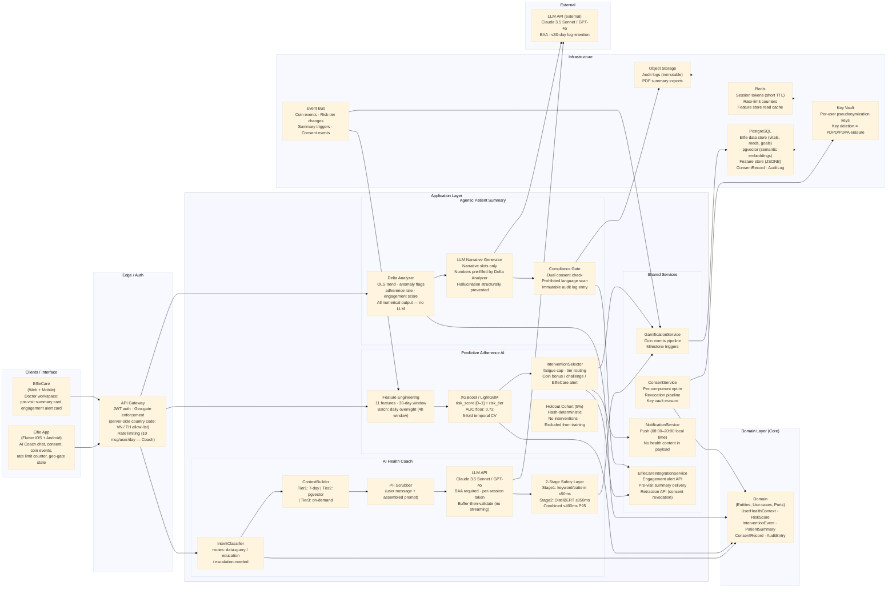
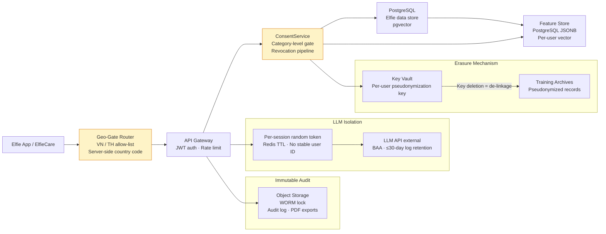

# AI Continuity Loop

## I. Problem Approach — Why Elfie Needs an AI Continuity Loop

Elfie already collects vitals, medication logs, wearable data, and lab results from millions of chronic disease patients across 30+ countries. The data exists; the infrastructure exists. What does not exist is a **closed loop** that turns that data into understanding for the patient, uses it to predict and prevent dropout, and routes it to the treating physician before every consultation — automatically, without any manual work from either side. Three individually useful features become a compounding flywheel when they share the same data pipeline and reinforce each other: AI Health Coach creates daily engagement → Predictive Adherence AI preserves that engagement → Agentic Patient Summary converts that engagement into clinical value.

### Core requirements

- **AI Health Coach:** natural-language Q&A against each user's own Elfie data; 2-stage safety layer (rule-based + ML classifier) blocking diagnostic or medication-directive outputs; tiered context retrieval (7-day immediate + semantic 90-day + on-demand full history); HIPAA BAA with LLM provider; hard escalation triggers for life-threatening readings; free for all users; VN + TH geo-gate at MVP
- **Predictive Adherence AI:** daily batch XGBoost/LightGBM scoring of all active users on 11 behavioral features; `risk_score` (0–1) + `risk_tier` (Low / Medium / High) output; risk-tiered intervention selector (gamification nudges → ElfieCare doctor alert); 5% holdout cohort for impact measurement; key vault-based right-to-erasure; quarterly bias audit per demographic slice; VN + TH geo-gate
- **Agentic Patient Summary:** 30-day inter-visit data synthesis pushed to ElfieCare before every consultation; application-layer rendering of all quantitative values (Delta Analyzer output — LLM never sees numbers); LLM writes only narrative text slots; dual consent (patient granular + doctor acknowledgment); compliance gate scans every LLM output before delivery; consent revocation deletes all pending summaries within 24 hours; VN + TH geo-gate
- **Cross-cutting:** explicit opt-in consent for each component; PII scrubbing before any LLM call; PDPD (Vietnam) + PDPA (Thailand) compliance; audit-immutable logs; gamification coin integration across all three; ElfieCare cross-team dependency confirmed before planning starts

### Assumptions

- Active Elfie user base: Vietnam + Thailand; ~50,000+ active users with chronic disease profiles eligible for scoring at MVP launch
- Elfie coin event dataset: 3B+ historical events available for training; new events stream daily
- ElfieCare cross-team: engineering team commits capacity for 9 ElfieCare deliverables (4 from Component 2, 5 from Component 3) before P1-G0 for each component
- LLM provider: Claude 3.5 Sonnet or GPT-4o; signed HIPAA BAA in place before any PHI is passed to the API
- Infrastructure: existing PostgreSQL + pgvector extension for embeddings; Redis for sessions, rate-limiting, and feature store; no GPU required for MVP (XGBoost batch scoring, DistilBERT-class inference CPU-viable)
- Regulatory: all three components are Non-device CDS (clinical decision support tools, not SaMD); Medical Affairs sign-off required on all user-facing copy and LLM system prompts before launch; EU / US expansion blocked pending AI Act and FDA review

## II. Design Document — approach summary

**Short summary (≤600 words)**

Core approach: a three-component, event-driven pipeline that shares the same underlying Elfie data store, consent model, and gamification infrastructure. Each component is independently deployable but designed to amplify the others.

**AI Health Coach** is an API-orchestrated conversational layer. User messages pass through an intent classifier, a tiered context builder (Tier 1: last 7 days, Tier 2: pgvector semantic retrieval up to 90 days, Tier 3: on-demand full history), and a PII scrubber before reaching the LLM API. The full LLM response is buffered, run through a 2-stage safety classifier (Stage 1: rule-based keyword/pattern ≤50ms; Stage 2: DistilBERT-class ML classifier ≤350ms), and only then delivered to the user. Streaming is deferred to v2 because SSE is architecturally incompatible with the post-generation safety check. Hard escalation triggers (BP >180/120, glucose <60 or >400, chest pain + dyspnea) suppress the AI response entirely and deliver a hardcoded safety message.

**Predictive Adherence AI** is a daily overnight batch pipeline. Feature engineering runs on 30-day behavioral windows (11 features per user) from the Elfie event log, writes to a per-user feature store (Postgres JSONB), and scores all eligible users through XGBoost/LightGBM. Outputs (`risk_score`, `risk_tier`) are written to the intervention queue. The intervention selector applies fatigue caps, checks doctor linkage and ToS acceptance, and dispatches push notifications, in-app cards, or ElfieCare engagement alert cards. A deterministic 5% holdout cohort (hash-based) receives no interventions and is excluded from training — it is the primary business impact measurement vehicle. Retraining is quarterly offline.

**Agentic Patient Summary** is a per-doctor-patient-pair pipeline, triggered either manually by the doctor in ElfieCare or on a 30-day schedule for active consent links. The Delta Analyzer computes quantitative trend directions (OLS slope), anomaly flags, adherence rates, and engagement scores entirely in application code — no LLM involvement in numerical computation. The LLM receives only named narrative slots to fill within a fixed template. A Compliance Gate verifies dual consent, scans LLM output for prohibited clinical interpretation language, and creates an immutable audit log entry before delivery. All quantitative fields in the physician-visible card are rendered directly from Delta Analyzer output; the LLM cannot hallucinate numbers that appear in the structured sections.

Build vs Buy (rule): build all patient-data-touching pipelines and safety layers — these are the product moat. Buy or use open-source for commodity infrastructure: LLM API, DistilBERT open-source weights, XGBoost/LightGBM, pgvector extension, Redis.

Multi-component deployment: all three components share the same user identity, consent infrastructure, gamification pipeline, and geo-gate enforcement. The event bus (Postgres LISTEN/NOTIFY or lightweight message queue) connects components: AI Coach conversation milestones publish coin events; Predictive AI risk-tier changes can trigger context enrichment for the Coach; Agentic Patient Summary pipeline reads from the same Elfie data store as the Coach context builder.

Data privacy model: default is minimal LLM exposure — Tier 1 context only unless user explicitly requests deeper history; per-session random token (not user ID) in all LLM API calls; PII scrubber runs twice (user message + assembled prompt); no model training on customer data; HIPAA BAA with LLM provider required before any PHI is processed; key vault-based erasure for Predictive AI training records.

Full design details and diagrams follow below.

### 2.1 System Diagram — explanation for drawing

#### Notes for the system Mermaid diagram (include Clean Architecture layers within the same diagram):
- Top/Interface: Clients (Elfie App iOS/Android, ElfieCare Web/Mobile) → API Gateway → Auth (JWT, user registration country for geo-gate)
- Application layer: three AI services (AICoachService, AdherenceAIService, PatientSummaryService), shared services (ConsentService, GamificationService, NotificationService, ElfieCareIntegrationService)
- Domain core: domain entities (UserHealthContext, RiskScore, InterventionEvent, PatientSummary, ConsentRecord) between Application and Infrastructure layers
- Infrastructure: PostgreSQL (shared data store + pgvector), Redis (session tokens, feature store, rate-limit), LLM API (external, BAA-gated), EventBus, ObjectStorage (audit logs)

#### System Diagram

#### Hierarchical legend — Components by Layer

- **Interface (Clients)**
	- **Elfie App** (Flutter iOS + Android): AI Coach chat UI, consent flows, coin events, rate-limit counter, geo-gate state, privacy settings.
	- **ElfieCare** (Web + Mobile): doctor workspace; pre-visit summary card (View / Dismiss / Snooze / Regenerate), engagement alert card, doctor ToS re-acceptance flow.

- **Application Layer**
	- *AI Health Coach*
		- **IntentClassifier**: routes user messages to data-query, education, or escalation-needed handling paths.
		- **ContextBuilder**: assembles tiered context (Tier 1: last 7 days; Tier 2: pgvector cosine similarity, top-5 results ≥0.75 threshold; Tier 3: on-demand full history for explicit temporal queries only).
		- **PII Scrubber**: two-point scrubbing — user message first, assembled prompt second — before any LLM call.
		- **LLM API client**: per-session random token; full response buffered before safety check; no streaming.
		- **2-Stage Safety Layer**: Stage 1 deterministic keyword/pattern matching (≤50ms); Stage 2 DistilBERT-class classifier (≤350ms); combined budget ≤400ms P95; unsafe responses rewritten, never delivered.
	- *Predictive Adherence AI*
		- **Feature Engineering**: 11 behavioral features on 30-day windows; mandatory 7-day temporal gap between feature cutoff date T and label window start; daily overnight batch.
		- **XGBoost / LightGBM**: AUC floor 0.72 (target 0.78); 5-fold temporal CV; Holdout cohort users excluded from training and evaluation.
		- **InterventionSelector**: maps `risk_tier` → intervention type; enforces per-user fatigue cap (max 1 intervention per 7 days per channel); suppresses ElfieCare alerts for doctors who have not re-accepted ToS.
		- **Holdout Cohort (5%)**: deterministic hash-based; scored but never receives interventions; primary impact measurement vehicle.
	- *Agentic Patient Summary*
		- **Delta Analyzer**: computes OLS trend direction (↑/→/↓/Insufficient), anomaly flags, adherence rate, engagement score, and data completeness per metric — entirely in application code.
		- **LLM Narrative Generator**: receives only trend classifications and narrative slot positions; all numerical values are pre-filled application-layer literals in the template; LLM cannot write numbers.
		- **Compliance Gate**: verifies dual consent before delivery; scans LLM output for prohibited clinical language; creates immutable audit log entry with `system_prompt_version` field; blocks delivery on consent absence or scan failure.
	- *Shared Services*
		- **ConsentService**: per-component opt-in; per-doctor-patient granular category toggles; revocation pipeline (24-hour deletion SLA for Patient Summary); stale-consent re-consent window (30 days); key vault deletion for Predictive AI training records.
		- **GamificationService**: coin pipeline for AI Coach milestones, Predictive AI triggered bonuses, risk-score improvement rewards.
		- **NotificationService**: local timezone delivery scheduling (08:00–20:00); health content excluded from push payload.
		- **ElfieCareIntegrationService**: engagement alert delivery with delivery confirmation; pre-visit summary push; retraction API client.

- **Domain Layer (Core)**
	- **Entities, Use-cases, Ports**: `UserHealthContext`, `RiskScore`, `InterventionEvent`, `PatientSummary`, `ConsentRecord`, `AuditEntry`; pure business rules with no infrastructure dependencies.

- **Infrastructure**
	- **PostgreSQL**: shared Elfie data store; pgvector extension for semantic embeddings; feature store (JSONB per user); ConsentRecord and AuditLog tables.
	- **Redis**: per-session LLM tokens (short TTL); rate-limit counters; feature store read cache.
	- **Object Storage**: immutable audit logs; PDF summary exports.
	- **Key Vault**: per-user pseudonymization keys for Predictive AI training records; key deletion satisfies PDPD/PDPA right-to-erasure without touching training archives.
	- **Event Bus**: coin events, risk-tier changes, summary triggers, consent events.

- **External**
	- **LLM API** (Claude 3.5 Sonnet / GPT-4o): HIPAA BAA required before any PHI is passed; API log retention ≤30 days; per-session random token (not user ID) in every call.

#### Data flow (numbered for caption):
1) User query → API Gateway geo-gate (VN/TH allow-list) → IntentClassifier → ContextBuilder → PII Scrubber → LLM API → 2-Stage Safety Layer → response delivered (or rewritten/blocked); coin event published to Event Bus on milestone.
2) Overnight batch: Feature Engineering reads Elfie event logs → feature vectors written to PostgreSQL feature store → XGBoost/LightGBM scores all eligible users → risk tiers written to intervention queue → InterventionSelector dispatches interventions via NotificationService or ElfieCareIntegrationService.
3) Summary trigger (manual or scheduled): Delta Analyzer reads Elfie data for doctor-patient pair → Compliance Gate checks dual consent → LLM Narrative Generator fills narrative slots → Compliance Gate scans output → summary card pushed to ElfieCare via ElfieCareIntegrationService → immutable audit log written to Object Storage.
4) Consent revocation: ConsentService marks consent revoked → Key Vault deletion (Predictive AI training records) + summary retraction API call (Patient Summary) + Coach conversation data deletion; all within published SLAs (24h for summaries, 72h for Coach data).

#### Caption for the figure: "AI Continuity Loop logical view (clean architecture embedded): interface → application (three AI services + shared services) → domain → infrastructure; event-driven, geo-gated, consent-governed, and LLM-isolated data flows."

### 2.2 Build vs Buy (concise table)

| Component | Decision | Rationale |
|---|---:|---|
| AI Coach context builder + tiered retrieval | Build | Personalization against Elfie data schema is core product differentiation |
| 2-stage safety layer (rule-based + classifier) | Build (DistilBERT open source) | Clinical safety is a hard requirement; off-the-shelf moderation not calibrated for health domain |
| Predictive AI feature engineering pipeline | Build | Feature design over Elfie's proprietary event schema is the data moat |
| Intervention selector + fatigue logic | Build | Gamification integration and tiered intervention logic is product-specific |
| Delta Analyzer (numerical summary computation) | Build | Structured clinical computation must be deterministic and auditable; no vendor |
| Compliance Gate (consent check + language scan) | Build | Dual consent check is product-specific; language scan requires health-domain tuning |
| LLM (conversational AI + narrative generation) | Buy (Claude 3.5 Sonnet / GPT-4o API) | World-class general reasoning; BAA available; faster TTM than self-hosting |
| ML model training framework | Buy / open source (XGBoost, LightGBM) | Industry-standard tabular ML; no GPU required; easy audit trail |
| Vector search | Buy / extension (pgvector on existing PostgreSQL) | Avoids separate vector DB; cost-effective at MVP scale |
| Session token store + rate limiting | Buy (existing Redis) | Already in Elfie infra; no net-new dependency |
| LLM safety classifier (base model) | Buy / open source (DistilBERT weights) | Open-source base; fine-tuned in-house on health domain data |
| Key vault (erasure mechanism) | Buy (cloud KMS or HashiCorp Vault) | Managed key lifecycle reduces compliance risk |
| Audit log immutability | Buy (object storage with object lock) | WORM retention satisfies PDPD/PDPA audit requirements |

### 2.3 Data Isolation & Privacy Architecture

#### Summary: shared application tier with per-component consent scoping. PostgreSQL enforces row-level data access through the ConsentService — no component reads data outside the categories the user has enabled. LLM API calls use per-session random tokens (not user identifiers); the token-to-user map lives only in Redis with short TTL. Predictive AI training records are pseudonymized via stable per-user keys held in a key vault; key deletion permanently de-links records without requiring deletion from training archives.

#### What to draw for data isolation:
- Show ConsentService as a gateway between application services and the PostgreSQL data store.
- Add per-user key icons from Key Vault pointing to Predictive AI training archives.
- Show LLM API calls passing a random session token, not user ID; Redis holds the mapping.
- Show audit log writes going to Object Storage with WORM lock.
- Show geo-gate router at API Gateway level blocking non-VN/TH requests before any data access.

#### Data isolation diagram (Mermaid)

#### Caption: "Consent-gated data access with LLM session token isolation, key vault-based erasure, and WORM audit logging."

### 2.4 Clinical safety & AI guardrails strategy

- **2-stage safety architecture for AI Coach:** deterministic rule-based check (Stage 1) catches explicitly prohibited patterns instantly; DistilBERT-class ML classifier (Stage 2) catches paraphrased or semantic-drift unsafe outputs. Buffer-then-validate ensures no partial response is ever visible to the user before both stages clear. The primary LLM is explicitly excluded from the safety layer — no LLM-judges-LLM pattern.
- **Hard escalation triggers are immutable code constants**, not configurable parameters: BP >180/120, glucose <60 or >400 mg/dL, chest pain + dyspnea co-occurrence. Changes require code deployment reviewed by a qualified medical professional.
- **LLM numerical isolation for Patient Summary:** the Delta Analyzer produces all quantitative values; the LLM receives only trend classifications (↑/→/↓/Insufficient), not numbers. This makes numerical hallucination in physician-visible fields structurally impossible regardless of prompt engineering.
- **System prompt version control:** system prompt updates for both AI Coach and Patient Summary require compliance gate test suite re-run + Medical Affairs sign-off (≤5 business days) + deployment via code change. Auto-update is prohibited. System prompt version is logged per AI Coach conversation and per summary in the audit log.
- **Compliance Gate per summary:** every Patient Summary generation passes through a language scanner before delivery. If the scanner fails or consent is absent, the doctor receives "Summary unavailable — please review patient record manually" — never a partial or non-consented summary.
- **Classifier validation gates:** Safety classifier (AI Coach Stage 2) must meet Precision ≥95%, Recall ≥90% on an independently annotated dataset (≥1,000 examples, ≥2 annotators with healthcare background, Cohen's kappa ≥0.80) before any real user sees the feature. Re-validation required after every classifier update and quarterly.
- **Non-device CDS framing:** all three components are positioned as data understanding and workflow tools, not SaMD. All user-facing copy and marketing language reviewed by Medical Affairs and Legal before launch. "AI doctor", "medical AI", and "diagnosis" are prohibited in all product copy.

### 2.5 Data privacy guarantees

- **No LLM training on patient data:** BAA explicitly covers no training on Elfie data; API log retention ≤30 days or zero-day retention. Predictive AI models are trained on pseudonymized records with synthetic data augmentation where needed.
- **Per-session token isolation:** every LLM API call uses a per-session random token generated fresh per conversation (not per user, not derived from user ID). Token-to-user mapping lives only in Redis with short TTL. Even if LLM API logs are subpoenaed, they cannot be linked to Elfie users.
- **PII scrubbing at two points:** user message and assembled context prompt both pass through a PII scrubber before reaching the LLM. The scrubber removes names, addresses, ID numbers, and other identifiers even when they appear in self-reported symptom text.
- **Key vault-based right to erasure (Predictive AI):** stable per-user pseudonymization key stored in key vault; key deletion renders all pseudonymized training records permanently non-re-linkable to the user — satisfying PDPD (Vietnam) Article 11 / PDPA (Thailand) Section 19 without requiring deletion from training archives. Erasure certificate generated on key deletion.
- **Consent revocation SLAs:** Patient Summary — all pending and delivered-but-unviewed summaries deleted within 24 hours; AI Coach conversation data — all stores deleted within 72 hours; audit log entries tombstoned (not deleted). Automated revocation pipelines with force-deletion escalation paths and defined runbooks.
- **Granular per-category consent (Patient Summary):** patient selects which data categories the doctor may see (vitals, medication adherence, physical activity, symptom logs, lab results, coin events). Each category is independently toggleable. Consent is per-doctor-patient pair, not global. Re-consent required when consent text version changes (30-day window before treated as revocation).
- **Geo-gate as first line of defense:** all three AI endpoints check server-side registered country code against VN/TH allow-list before any data access. IP-address-based restriction is not used (easily circumvented and irrelevant for residents). Allow-list expansion requires legal review + config update + localized copy in the same release.

### 2.6 Cost model — Consumer free tier + B2B monetization

Pricing philosophy: AI Continuity Loop features are free for all Elfie App users at MVP — consistent with Elfie's "free for everyone" DNA. Monetization comes from the value delivered to B2B partners (insurers, pharma, healthcare providers), not from charging patients.

**Free tier (all consumer users, VN + TH):**
- AI Health Coach: 10 messages/day; all conversation history retained; all safety features always on
- Predictive Adherence AI: scoring runs silently; gamification nudges delivered as part of existing coin/challenge engine; no user-visible "AI" label at nudge level
- Agentic Patient Summary: free for patients who opt in; free for doctors in ElfieCare

**Premium consumer tier (v2+, insurer-sponsored users):**
- Higher AI Coach daily message limit (e.g., 30–50/day)
- Enhanced context depth (full history always available)
- Priority queue for Patient Summary generation

**B2B uplift (existing Elfie commercial model):**

| Partner type | AI Continuity Loop value add | Commercial mechanism |
|---|---|---|
| Insurers | Predictive AI reduces dropout → lower claims; Coach increases adherence → measurable outcomes | Outcome-based contract; per-member-per-month uplift |
| Pharma (ElfiePSP) | Adherence signal + Patient Summary = real-world evidence asset | PSP contract add-on; per-program fee |
| Healthcare providers | Pre-visit Patient Summary saves 5–10 min/consultation → 150h/doctor/year | ElfieCare enterprise tier; per-seat or per-patient fee |
| ElfieData consortium | Consented, longitudinal, labeled (risk-scored) dataset | Anonymized data licensing to research consortium |

**LLM API cost estimates (MVP scale):**
- AI Coach: avg 5 messages/active user/day × 2,000 tokens/message × Claude Sonnet pricing ≈ $0.008/user/day; at 10,000 DAU ≈ $80/day ($2,400/mo)
- Patient Summary: ~1 summary per patient per 30 days × avg 3,000 tokens/summary ≈ $0.0048/summary; at 5,000 summaries/mo ≈ $24/mo
- Total LLM cost at MVP scale: well under $5,000/mo; scales linearly with DAU

## III. Team & Delivery Plan

Deliver the three components sequentially by dependency risk, with Component 1 (AI Health Coach) first (no cross-team dependency), Component 2 (Predictive Adherence AI) second (ElfieCare dependency scoped to alert API only), and Component 3 (Agentic Patient Summary) third (ElfieCare dependency is largest — 5 new deliverables). This sequencing lets the team validate the safety layer and LLM integration before adding ML infrastructure, then adds the most complex cross-team dependency last when ElfieCare capacity is confirmed.

### 9-Month Plan — Component 1 → Component 2 → Component 3 (18 × 2-week sprints)

**Assumptions:** Core team = Tech Lead (1.0), Backend Eng x2, Frontend/Mobile Eng (Flutter) x1, ML Engineer x1 (Part-time or contractor), Medical Affairs reviewer (0.25), QA/Tester (0.5), PM/Product (0.5). ElfieCare engineering team: separate team, dependency confirmed before planning. Goal: deliver all three components to production in 9 months with full safety, consent, and regulatory compliance gates.

---

**Phase 1 — AI Health Coach (Sprints 1–6, Months 1–3)**

- **S1 — Infra baseline + LLM integration scaffold**
	- Deliver: BAA signed and on file; LLM API client with per-session token; PII scrubber v0 (regex-based); pgvector extension on staging DB; geo-gate enforcement at API layer; rate-limit middleware (10/user/day in Redis).
	- Acceptance: LLM API call succeeds with random token; geo-gate blocks non-VN/TH in integration test; rate limit enforced.

- **S2 — Context builder (Tier 1 + Tier 2)**
	- Deliver: Tier 1 context pipeline (last 7 days vitals/meds/steps); pgvector embedding pipeline for Elfie health records; Tier 2 semantic retrieval (cosine similarity, top-5, ≥0.75); timezone normalization for all context timestamps.
	- Acceptance: context assembly unit tests; Tier 2 retrieval integration test on synthetic user records; timezone test covering UTC+7, UTC+8, UTC fallback.

- **S3 — 2-stage safety layer**
	- Deliver: Stage 1 keyword/pattern rules (versioned, PR-reviewed); DistilBERT-class Stage 2 scaffold with open-source base weights; safety classifier annotation dataset (≥1,000 labeled examples with ≥2 healthcare annotators); classifier training pipeline; buffer-then-validate response architecture.
	- Acceptance: Stage 1 latency ≤50ms; Stage 1 + 2 combined ≤400ms P95; kappa ≥0.80; classifier precision ≥95%, recall ≥90% on holdout. **Gate: Medical Affairs reviews validation dataset before any real-user test.**

- **S4 — Hard escalation + disclaimer system**
	- Deliver: hard escalation trigger constants (immutable code); hardcoded safety messages per trigger; treatment-adjacent disclaimer UI block (iOS + Android + web); citation enforcement for clinical claims.
	- Acceptance: integration tests for all 4 hard escalation triggers; disclaimer presence check across test suite.

- **S5 — Consent flow + gamification + mobile UI**
	- Deliver: AI Coach opt-in consent modal (Medical Affairs + Legal copy sign-off); conversation history screen; AI transparency badge; rate-limit counter with timezone reset; Settings → Privacy → AI Coach section; coin milestone events; geo-gate "not available" state.
	- Acceptance: full mobile UI spec delivered across 9 surfaces; consent revocation pipeline integration test.

- **S6 — Red-team, QA hardening, and Component 1 launch gate**
	- Deliver: adversarial test suite ≥100 red-line prompts (zero failures); regression suite ≥300 test cases (50 per query category); performance smoke test (P95 latency end-to-end ≤1.5s); safety classifier quarterly schedule set.
	- **Launch Gate 1:** Medical Affairs sign-off on all copy and system prompt; BAA on file; adversarial suite passes; classifier validated; geo-gate confirmed.

---

**Phase 2 — Predictive Adherence AI (Sprints 7–12, Months 4–6)**

- **S7 — Feature engineering pipeline + feature store**
	- Deliver: 11-feature engineering pipeline with 7-day temporal gap enforcement; feature store schema (PostgreSQL JSONB); batch pipeline scaffold (daily overnight); holdout cohort deterministic hash logic; synthetic user trajectory unit tests.
	- Acceptance: all 11 features populated for ≥95% of eligible users in staging batch; holdout cohort correctly excluded from scoring queue.

- **S8 — Model training + validation**
	- Deliver: XGBoost/LightGBM training pipeline; 5-fold temporal cross-validation; label definition AC (sustained dropout definition: <2 logs/week for 2 consecutive weeks within 21 days); label construction with temporal gap; bias evaluation script (bootstrap confidence intervals per demographic slice).
	- Acceptance: AUC ≥ 0.72 (floor); Precision@top10% ≥60%; Brier ≤0.22; **ML validation report reviewed and signed by Technical Advisor before staging promotion.**

- **S9 — Intervention selector + notification pipeline**
	- Deliver: intervention selector (tier → intervention mapping); fatigue cap enforcement (max 1 per 7 days per channel); coin bonus integration via GamificationService; push notification pipeline enhancements (timezone delivery window, idempotency key, no health content in payload).
	- Acceptance: intervention dispatch integration test per tier; fatigue cap unit test; coin award end-to-end test.

- **S10 — ElfieCare engagement alert (cross-team dependency)**
	- Deliver (Elfie side): ElfieCareIntegrationService engagement alert client; delivery confirmation handler; doctor ToS re-acceptance flow; High-tier suppression for non-accepting doctors.
	- Deliver (ElfieCare side — dependency): alert API endpoint; alert card UI (Dismiss / Snooze 7 days); delivery confirmation endpoint; ToS re-acceptance screen.
	- Acceptance: end-to-end engagement alert delivery with delivery confirmation; High-tier suppressed for non-ToS-accepting doctor; ElfieCare team sign-off.

- **S11 — Key vault erasure + consent + bias monitoring**
	- Deliver: key vault integration for stable per-user pseudonymization; erasure pipeline (key deletion + erasure certificate); bias monitoring quarterly runnable script; demographic-slice AUC with bootstrap CI and minimum-slice-size guard (≥1,000 users / ≥200 positive labels).
	- Acceptance: erasure pipeline integration test; bias script produces valid report in staging; minimum-slice guard excludes underpowered slices.

- **S12 — Batch hardening + Component 2 launch gate**
	- Deliver: atomic batch commit (staging table swap, no split-state); maximum score age policy (High-tier interventions suppressed after 36 hours staleness); monitoring alerts (batch completion, queue depth); intervention audit log.
	- **Launch Gate 2:** ML validation report signed; ElfieCare commitment on alert API; consent flow reviewed by Legal; geo-gate confirmed; bias baseline documented.

---

**Phase 3 — Agentic Patient Summary (Sprints 13–18, Months 7–9)**

- **S13 — Delta Analyzer + summary pipeline scaffold**
	- Deliver: Delta Analyzer (OLS slope, anomaly detection, adherence rate, engagement score, completeness score per category); zero-length period guard (`SUMMARY_MIN_PERIOD_DAYS = 3`); idempotency logic per `(patient_id, doctor_id, period_start)`; summary atomicity (fail-open with "unavailable" message on any stage failure).
	- Acceptance: Delta Analyzer unit tests with synthetic data (20 user trajectories); idempotency integration test; atomicity test (simulated pipeline failure at each stage).

- **S14 — LLM narrative generator + Compliance Gate**
	- Deliver: fixed template with pre-filled numerical literals from Delta Analyzer; LLM slot context (trend classifications only, no numbers); prohibited clinical language scanner; system prompt version logging; system prompt version change gate (compliance suite re-run + MA sign-off).
	- Acceptance: numerical-token detection check confirms no numbers in LLM slot context; Compliance Gate blocks delivery on consent failure and on language scan failure; system prompt version logged in every audit entry.

- **S15 — Dual consent system (patient + doctor)**
	- Deliver: patient granular consent modal (6 data categories + coin events toggle); per-doctor-patient consent storage; doctor one-time acknowledgment modal; stale-consent re-consent mechanism (30-day window); consent revocation pipeline (24-hour deletion SLA + retraction API call to ElfieCare).
	- Acceptance: consent lifecycle integration tests (grant → active → stale → re-consent and grant → revoke); revocation pipeline deletes all summaries within SLA in staging; stale-consent pauses scheduled push.

- **S16 — ElfieCare integration for Patient Summary (cross-team dependency)**
	- Deliver (Elfie side): summary payload serialization; scheduled push job (midnight VN/TH local); on-demand trigger endpoint; PDF export generation.
	- Deliver (ElfieCare side — dependency): pre-visit summary card UI (View / Dismiss / Snooze / Regenerate); doctor acknowledgment flow; inbound summary API; "summary unavailable" state; retraction API endpoint.
	- Acceptance: end-to-end summary delivery in staging (manual trigger + scheduled); PDF export verified; retraction API deletes unviewed summaries within SLA; "unavailable" state renders correctly.

- **S17 — Completeness transparency + geo-gate + audit hardening**
	- Deliver: per-category completeness score rendered in summary card and PDF; "No prior data" rendering for missing prior period; geo-gate server-side enforcement (VN/TH registered patients + their treating doctors); immutable audit log written to Object Storage per summary; WORM lock verified.
	- Acceptance: completeness score unit tests; geo-gate integration test; audit log immutability test; Legal review of consent copy and disclaimer header in PDF.

- **S18 — Red-team, QA hardening, and Component 3 launch gate**
	- Deliver: adversarial Compliance Gate test suite (≥50 prohibited language examples, zero failures); end-to-end staging test with synthetic patient population; performance test (summary generation SLA); monitoring dashboards; incident runbook for consent revocation pipeline failure.
	- **Launch Gate 3:** TA sign-off on Delta Analyzer numerical isolation; Medical Affairs sign-off on Compliance Gate language list and system prompt; Legal sign-off on consent copy and PDF disclaimer; ElfieCare retraction API confirmed; BAA re-verified.

---

### Notes & tradeoffs

- Do not start Component 2 until AI Coach safety layer passes Launch Gate 1 — the LLM infrastructure and BAA are dependencies.
- ElfieCare dependency is the single largest delivery risk. Confirm ElfieCare capacity for all 9 deliverables (Components 2 + 3 combined) in a single consolidated plan before P1-G0. Do not allow Components 2 and 3 to proceed independently — ElfieCare cannot absorb two separate planning tracks.
- Keep ML model training (S8) on the critical path but isolated from application delivery. A model that does not clear the AUC floor does not block application delivery — the intervention queue simply has no scores to dispatch until the model passes.
- If design owner for Premium Engagement Card is not confirmed at Week 0 (S9 dependency), default to standard in-app banner for MVP. Do not block S9 on Figma mockup.

### Target milestones

- **M0 (W0–W2):** BAA signed, infra baseline, LLM API integrated, geo-gate enforced, pgvector on staging.
- **MVP (AI Health Coach) — W12 (M3):** AI Coach in production with full safety layer, consent, gamification, and mobile UI.
- **v1 (Predictive Adherence AI) — W24 (M6):** Predictive AI live; ElfieCare engagement alerts active; bias baseline documented; holdout cohort running.
- **v1.5 (Agentic Patient Summary) — W36 (M9):** Patient Summary live; dual consent system active; ElfieCare summary cards delivered; all three components forming the full AI Continuity Loop.

### Staffing & ramp

- **M0:** Tech Lead (W0), Backend Eng #1 (W0), Backend Eng #2 (W0), Flutter Mobile Eng (W0), ML Engineer part-time/contract (W0, starts active at S7), QA (W0), PM (W0), Medical Affairs reviewer (0.25 FTE, consulting).
- **M4:** Backend Eng #3 (joins before S10 for ElfieCare integration sprint).
- **M6:** Consider second QA or test automation engineer for Phase 3 hardening.
- **Post-launch:** Customer Success (M10+) for doctor onboarding; Legal / compliance consultant for PDPD/PDPA audit readiness.

### Headcount (typical FTE)

- M0–M3 (Phase 1): ~6.5 FTE + Medical Affairs consultant
- M4–M6 (Phase 2): ~7.5 FTE
- M7–M9 (Phase 3): ~8–9 FTE

### Acceptance & success metrics

- AI Coach: end-to-end P95 latency ≤1.5s; Safety classifier precision ≥95% / recall ≥90%; adversarial suite zero failures; DAU conversation rate ≥20% within 30 days of launch
- Predictive AI: AUC ≥0.72 (floor) on production holdout; Precision@top10% ≥60%; Brier ≤0.22; holdout cohort retention delta ≥+5 percentage points at 90-day read
- Patient Summary: summary generation SLA met ≥99% of scheduled triggers; Compliance Gate prohibits all language scan positives in red-team; doctor view rate ≥50% within 24h of delivery
- Retention (system-level): Elfie 1-year retention improves from 55% (current baseline, consumer) toward 65%+ for AI Continuity Loop enrolled users

### Riskiest assumption

**ElfieCare engineering team commits sufficient capacity for all 9 deliverables (Components 2 + 3) before planning begins.** Both Predictive Adherence AI and Agentic Patient Summary have non-negotiable ElfieCare dependencies. If ElfieCare cannot confirm capacity before P1-G0, neither component can be approved for development start. The business impact of the AI Continuity Loop (doctor buy-in, retention loop closure, clinical credibility) depends entirely on the ElfieCare integration being live.

**Concrete failure scenarios:**

- **Scenario A — Capacity shortfall:** ElfieCare confirms capacity for Component 2 (4 deliverables) but cannot commit to Component 3 (5 deliverables) until M8. Impact: Patient Summary launch delayed to M12+; AI Continuity Loop flywheel does not close in the planned window. Mitigation: re-sequence to launch Component 3 first (Delta Analyzer + Compliance Gate have no ElfieCare dependency until S16) and keep ElfieCare integration as the last sprint — this buys 4 extra weeks for ElfieCare capacity confirmation.
- **Scenario B — API design mismatch:** ElfieCare implements inbound API with incompatible payload schema. Impact: integration sprint (S10 / S16) blocked; launch delayed 2–4 weeks. Mitigation: API contract (request/response schema, error codes, delivery confirmation semantics) agreed in writing at P1-G0 for each component, before any implementation begins.
- **Scenario C — ElfieCare retraction API deprioritized:** ElfieCare implements summary delivery but not the retraction API. Impact: consent revocation 24-hour SLA for Patient Summary cannot be met for summaries already pushed to ElfieCare. Mitigation: retraction API is a launch gate requirement for Component 3 — Compliance Gate holds delivery until retraction API is confirmed live and tested.

**Validation steps (M0):**

1. Joint planning session: ElfieCare EM, Elfie PM, and Tech Lead; produce a single capacity plan covering all 9 deliverables with sprint allocations and delivery commitments.
2. API contract workshop: define inbound engagement alert API, summary delivery API, and retraction API contracts in a shared spec document. Sign off before any Phase 2 development begins.
3. Confirm Medical Affairs resource availability for 3 system prompt reviews and quarterly compliance gate re-runs across the 9-month timeline.

## IV. Clinical Safety & Regulatory Module

This section describes the clinical safety and regulatory compliance model for all three AI components of the AI Continuity Loop, synthesized from the approved specs and the AGENTS.md rules.

### 1) Problem statement

Elfie operates in two regulated markets (Vietnam — PDPD / Circular 30/2023; Thailand — PDPA 2019 / Digital Health Regulations). All three AI components process Protected Health Information (PHI) and generate AI-assisted outputs that users and doctors may act on. Three distinct regulatory risks must be managed:

- **AI Coach:** risk of CDS-adjacent outputs crossing into clinical decision support, triggering SaMD classification or medical liability. Risk of the LLM hallucinating clinical values or generating diagnostic claims.
- **Predictive Adherence AI:** risk of algorithmic bias against demographic groups (elderly, rural, lower-engagement populations) producing discriminatory intervention rates. Risk of training data pseudonymization failures making right-to-erasure unenforceable.
- **Agentic Patient Summary:** risk of the LLM fabricating numerical values that appear in a physician-visible clinical document. Risk of patient data shared with doctors without granular consent or with expired consent.

### 2) Regulatory framework (3 tiers)

- **Tier 1 — Non-device positioning:** All three components are positioned as data understanding tools and workflow aids — not SaMD, not clinical decision support systems. This is not just a legal framing; it is enforced through technical design: the AI Coach cannot diagnose, the Predictive AI does not prescribe treatment, the Patient Summary is explicitly "a well-organized copy of the patient's own self-reported data." All user-facing copy, marketing language, and onboarding screens are reviewed by Medical Affairs and Legal before launch. Prohibited terms: "AI doctor", "medical AI", "diagnosis", "clinical recommendation."

- **Tier 2 — Consent and data governance:** Per-component opt-in consent; per-category granular consent for Patient Summary; consent revocation with defined SLAs; stale-consent re-consent mechanism; doctor re-acknowledgment on ToS update. All consent flows reviewed against PDPD (Vietnam) Article 11 and PDPA (Thailand) Section 19. Consent text version-controlled; re-consent required on any material update.

- **Tier 3 — AI output quality gates:** Safety classifier validation (Precision ≥95%, Recall ≥90%, kappa ≥0.80) before AI Coach goes live. Compliance Gate prohibits clinical interpretation language in every Patient Summary before delivery. System prompt changes for both components require Medical Affairs sign-off and compliance test re-run. All system prompt versions logged per interaction in immutable audit trail.

### 3) Module A — AI Coach Safety Layer

- **Hard escalation triggers (immutable):** BP >180/120, glucose <60 or >400 mg/dL, chest pain + dyspnea co-occurrence, suicidal ideation keyword. When matched: AI response suppressed; hardcoded safety message only. These are code constants, not runtime-configurable.
- **2-stage safety classifier:** Stage 1 pattern matching (diagnostic claims, medication directives, symptom dismissal) + Stage 2 DistilBERT-class ML classifier. Both stages must pass before response is delivered. Combined latency budget ≤400ms P95.
- **Non-diagnostic framing enforcement:** "normal" and "abnormal" as standalone assessments are prohibited. All comparative framing required ("higher than last month", "within your doctor-set target range"). Every clinical guideline reference must be cited inline.
- **AI identity disclosure (EU AI Act Art. 52 preparedness):** three mandatory disclosure locations — onboarding consent screen, persistent chat header, footer of every AI response — even though EU launch is blocked pending AI Act conformity assessment.

### 4) Module B — Predictive Adherence AI Governance

- **Bias monitoring:** quarterly per-demographic-slice AUC evaluation with bootstrap confidence intervals. Minimum slice size: ≥1,000 users with ≥200 positive labels for a slice to be included in the bias report. Slices below minimum are flagged as "underpowered — excluded from bias evaluation" rather than reported as passing. Demographics: age group, disease type, geo-subregion (VN vs. TH), family-paired status.
- **Label quality protection:** sustained dropout label (`<2 logs/week for 2 consecutive weeks within next 21 days`), not single-week dip. Mandatory 7-day temporal gap between feature cutoff date T and label observation window start to prevent leakage. "Active" baseline defined as ≥1 authenticated app open in the last 7 days (not 30 days).
- **Holdout cohort:** 5% of eligible users receive no interventions and are excluded from training. This is the ethical and statistical minimum for measuring impact without full A/B infrastructure. Any retraining signal that includes intervention-exposed users must be documented and the confound acknowledged.
- **Doctor alert delivery guarantee:** ElfieCare engagement alerts have a delivery confirmation SLA (not best-effort). High-tier alerts that do not receive delivery confirmation within 1 hour trigger a push notification retry. Alert delivery state (sent / confirmed / failed) is logged; clinical response by the doctor is explicitly NOT logged (log delivery state only, not clinical action).

### 5) Module C — Patient Summary Compliance Gate

- **Dual consent pre-check:** Compliance Gate verifies both patient consent (active, not stale, category subset) and doctor acknowledgment (active, not lapsed) before every summary delivery. Either absent → "Summary unavailable" message to doctor.
- **Numerical isolation:** the LLM slot context contains only trend classifications (↑/→/↓/Insufficient), patient's primary condition, and period dates. Raw numerical values from Delta Analyzer are explicitly excluded from the LLM prompt. Numerical hallucination in physician-visible sections is structurally impossible even if the system prompt is ignored.
- **Language scanner rules:** prohibited patterns (examples): "indicates", "suggests", "consistent with", "you should", "consider changing", "results indicate [disease]", "abnormal [biomarker]" as standalone assessment. Scanner is versioned; changes require Medical Affairs approval. Zero-tolerance: Compliance Gate blocks any summary where the scanner returns a match.
- **Retraction API as regulatory requirement:** consent revocation must delete summaries from the doctor's ElfieCare queue, not just from Elfie's backend. The retraction API is a hard launch gate for Component 3 — without it, the 24-hour deletion SLA cannot be guaranteed for summaries already pushed.

### 6) Acceptance criteria examples for regulatory compliance

- All user-facing copy (Coach onboarding, consent modals, disclaimer text, summary PDF header) reviewed and signed by Medical Affairs + Legal before first external user sees any component.
- AI Coach adversarial test suite (≥100 red-line prompts): zero prohibited outputs permitted.
- Safety classifier validated before real-user access: precision ≥95%, recall ≥90%, kappa ≥0.80 on independently-annotated dataset.
- Patient Summary Compliance Gate: zero prohibited language patterns in red-team suite of ≥50 adversarial prompts.
- Bias audit baseline documented before Predictive AI goes live; slices below minimum size excluded (not reported as passing).
- Consent revocation SLA tested in staging: 24h for Patient Summary summaries, 72h for AI Coach conversation data.

## V. Requirement mapping

| Key requirement | Where answered in final.md |
|---|---|
| AI Health Coach — natural language Q&A against personal health data | Section II — System Diagram (IntentClassifier, ContextBuilder); Section II.4 Clinical safety strategy; Section III — Phase 1 sprint plan (S1–S6) |
| 2-stage safety layer (rule-based + ML classifier) | Section II.1 — Application Layer (2-Stage Safety Layer); Section II.4; Section IV — Module A; Section III — S3 |
| Hard escalation triggers (life-threatening readings) | Section II.4; Section IV — Module A; Section III — S4 |
| Tiered context retrieval (Tier 1/2/3 + pgvector) | Section II.1 — ContextBuilder; Section II.2 (Build vs Buy — pgvector); Section III — S2 |
| Predictive dropout model (XGBoost/LightGBM, 11 features, batch daily) | Section II — Design Document summary; Section II.1 — Application Layer (Predictive Adherence AI); Section III — Phase 2 sprint plan (S7–S8) |
| Risk-tiered intervention selector + gamification integration | Section II.1 — InterventionSelector; Section III — S9; Section IV — Module B |
| ElfieCare engagement alert (doctor-facing) | Section II.1 — ElfieCareIntegrationService; Section III — S10; Section IV — Module B (doctor alert delivery guarantee) |
| 5% holdout cohort for impact measurement | Section II.1 — Holdout Cohort; Section IV — Module B; Section III — S7 |
| Key vault-based right-to-erasure (Predictive AI) | Section II.3 — Erasure Mechanism diagram; Section II.5; Section IV — Module B; Section III — S11 |
| Bias monitoring with bootstrap CI and minimum slice size | Section II.1 — Feature Engineering; Section IV — Module B; Section III — S11 |
| Agentic Patient Summary — pre-visit 30-day data synthesis | Section II — Design Document summary; Section II.1 — Agentic Patient Summary; Section III — Phase 3 sprint plan (S13–S18) |
| Delta Analyzer (numerical computation, no LLM) | Section II.1 — Delta Analyzer; Section II.4; Section IV — Module C; Section III — S13 |
| Compliance Gate (dual consent check + language scan + audit log) | Section II.1 — Compliance Gate; Section IV — Module C; Section III — S14 |
| Dual consent system (patient granular + doctor acknowledgment) | Section II.3; Section II.5; Section IV — Module C; Section III — S15 |
| Consent revocation SLAs + retraction API | Section II.5; Section IV — Module C; Section III — S15, S16 |
| Geo-gate enforcement (VN + TH server-side) | Section II.3 — Geo-Gate Router; Section II.5; Section III — S1 |
| PII scrubbing (two-point before LLM) | Section II.1 — PII Scrubber; Section II.5; Section III — S1 |
| HIPAA BAA with LLM provider | Section II.2 (Build vs Buy); Section II.5; Section IV; Section III — S1 (Launch Gate prerequisite) |
| Gamification integration (coins across all components) | Section II.1 — GamificationService; Section II.6 — Cost model; Section III — S5, S9 |
| Non-device CDS regulatory framing | Section II.4; Section IV — Module A (Tier 1); all three component launch gates |
| System Architecture Diagram — logical & deployment view | Section II.1 — System Diagram (Mermaid block) and legend |
| Design Document (condensed ≤600 words) | Section II — top of section contains the condensed Design Document |
| Team & Delivery Plan — three components in 9 months | Section III — full 18-sprint plan with staffing and milestones |
| Clinical Safety & Regulatory Module | Section IV — full module covering Modules A, B, C |
| ElfieCare cross-team dependency plan | Section III — S10, S16; Riskiest Assumption and failure scenarios |

## VI. Product Risks & Trade-offs

### 6.1 Product Risks

- **ElfieCare dependency blocking:** all three components have ElfieCare cross-team dependencies. If ElfieCare engineering cannot commit capacity, Components 2 and 3 cannot ship on the planned timeline. This is the single highest-impact risk.
- **Safety classifier validation failure:** if the DistilBERT-class classifier does not achieve Precision ≥95% / Recall ≥90% on the health-domain annotation task, AI Coach cannot launch. Annotation is a gating activity that takes 4–8 weeks (recruiting annotators with healthcare background, annotation rounds, kappa measurement). Starting annotation in S1 is mandatory.
- **LLM hallucination in Patient Summary narrative:** even with numerical isolation, the LLM could generate narrative that implies a clinical finding ("the consistent rise in blood pressure is a concerning pattern suggesting worsening hypertension"). The Compliance Gate language scanner must catch this. False negatives in the scanner are the residual safety risk.
- **Predictive AI AUC floor miss:** if 11 MVP features cannot achieve AUC ≥0.72 on production data, the intervention selector will fire too many false-positive interventions, degrading user trust. The AUC threshold is validated at P1-G0 (offline experiment on real data) before any production deployment.
- **Demographic bias in Predictive AI:** elderly users, rural users, or users with lower-frequency disease types may have systematically lower engagement baselines, causing the model to over-flag them as high-risk. Bias audit baseline must be documented before launch, not after.
- **Doctor adoption of Patient Summary:** the AI Continuity Loop closes only if doctors actually view the pre-visit summary card in ElfieCare. If doctors dismiss cards without reading, the clinical value proposition is not realized. Doctor-facing UX and onboarding plan are co-dependencies outside this spec.
- **Consent fatigue:** patients face three separate opt-in consent flows (one per component). If the consent UX is not carefully designed, high opt-out rates will reduce data quality and loop completeness.
- **Cost overrun (LLM API):** LLM API costs scale linearly with DAU. If AI Coach daily active users exceed estimates by 5×, monthly LLM cost exceeds $10,000. Rate limiting (10 messages/day free tier) is the primary cost control; monitoring and alerts must be in place from day 1.

### 6.2 Key Trade-offs

- **Safety vs. UX (buffered response):** full buffer-then-validate prevents streaming, adding perceived latency. The trade-off is correct — streaming with a post-generation safety check is architecturally unsound for a health AI; partial responses in clinical context are worse than slower responses. Streaming is deferred to v2 with a separate safety architecture review.
- **LLM numerical isolation vs. narrative quality (Patient Summary):** stripping numbers from the LLM slot context prevents hallucination but limits the LLM to purely qualitative narrative ("blood pressure has been consistently rising") without magnitude ("by 8 mmHg"). The physician sees exact values in the application-layer rendered table directly above the narrative. The trade-off is correct — the LLM's role is trend framing, not numerical reporting.
- **11-feature MVP vs. higher-accuracy model:** deferring 5 high-signal features (`medication_time_variance`, `bp_trend_14d`, `weight_volatility`, `sleep_regularity_score`, `last_vital_logged_hours`) to v2 reduces model accuracy but aligns acceptance criteria with actual MVP scope and avoids the AUC benchmark mismatch that was the primary CRIT-1 defect in the initial spec draft.
- **Shared PostgreSQL (cost) vs. dedicated vector DB (scale):** pgvector on existing PostgreSQL avoids net-new infrastructure at MVP. At >100,000 DAU with heavy Tier 2 retrieval, a dedicated vector database (Pinecone, Weaviate) may be needed. pgvector is the correct MVP choice; migration path is documented.
- **Batch-only Predictive AI vs. real-time:** daily overnight batch is sufficient for a 2–3 week dropout prediction horizon. Real-time scoring adds significant infrastructure complexity (streaming feature engineering, online serving) with marginal improvement for the use case. Batch-only is the correct MVP architecture.
- **Holdout cohort vs. full A/B framework:** a 5% holdout cohort provides controlled impact measurement without the infrastructure and ethical complexity of a full A/B framework. The trade-off is correct for MVP — holdout size is large enough for statistical significance at expected scale (50,000 active users × 5% = 2,500 holdout users).

## VII. GTM (Go-To-Market) Short Plan, North Star, and Pilot Requirements

### 7.1 Short-term GTM goals (Months 1–12)

- **Month 1–3 (Phase 1 complete):** launch AI Coach to early access users in Vietnam and Thailand. Target: 10,000 conversations in first 30 days. Measure conversation completion rate, safety classifier false-positive rate (user experience friction), and coin milestone conversion.
- **Month 4–6 (Phase 2 complete):** activate Predictive Adherence AI for all consenting users. Measure holdout cohort 90-day retention delta. Publish first bias audit baseline. Activate first insurer partnership pilot leveraging adherence signal.
- **Month 7–9 (Phase 3 complete):** launch Agentic Patient Summary to all consented doctor-patient pairs. Measure doctor view rate (<24h), consultation time savings, and patient data sharing opt-in rate. Publish case study from first healthcare provider pilot.
- **Cross-component:** publish "AI Continuity Loop" messaging for B2B partners (insurers, pharma) emphasizing the closed-loop consumer app → AI → doctor data flow as a market-unique asset.

### 7.2 North Star Metric

- **AI Continuity Loop Enrolled Users:** number of unique Elfie users (VN + TH) who have activated at least one AI Continuity Loop component (consented to AI Coach, or enrolled in Predictive AI, or linked to a doctor with Patient Summary consent active) AND have had at least one AI-triggered touchpoint in the last 30 days.
- Secondary metrics: AI Coach daily conversation rate; Predictive AI intervention response rate (intervention-exposed vs. holdout retention delta); Patient Summary doctor view rate; 1-year retention rate for enrolled vs. non-enrolled users; insurer partner NPS.

### 7.3 GTM roadmap (high level)

1. **Early access (Months 1–3):** AI Coach invite-only for 1,000 power users in Elfie's Vietnam community. Collect conversation safety data, measure retention impact, iterate on onboarding consent copy based on opt-in rate.
2. **General availability Vietnam + Thailand (Month 4):** full rollout to all eligible VN/TH users (geo-gate). Predictive AI silent background scoring begins.
3. **Doctor network activation (Months 5–7):** onboard first 50 ElfieCare doctors to the engagement alert program. Run Predictive AI + Patient Summary in tandem for linked doctor-patient pairs. Collect doctor feedback on summary quality and ElfieCare UX.
4. **B2B partnership pitch (Months 6–9):** present AI Continuity Loop retention data to insurer and pharma partners. Propose outcome-based contracts using holdout cohort retention delta as the evidence baseline. Pharma PSP add-on for adherence signal.
5. **International expansion scoping (Month 9+):** begin EU AI Act conformity assessment and FDA Non-device CDS framing review for US. Target EU/US launch 12–18 months post-MVP subject to regulatory sign-off.

### 7.4 Information required from pilot users (for development & evaluation)

- **Doctors (ElfieCare pilots):** confirmation of ElfieCare workspace access; list of patient types (disease areas) to prioritize in Patient Summary; preferred summary format feedback (which data categories are most useful); confirmation that consent flow language is clinically appropriate before rollout; feedback on engagement alert frequency and fatigue threshold.
- **Patients (Elfie App early access):** opt-in consent (per component); disease area and existing Elfie data depth (at least 30 days of data for meaningful Patient Summary); language preference (Vietnamese / English); device type (iOS / Android) for UX testing.
- **Insurer partners:** confirmation of outcome metric definitions (what counts as "adherence improvement"?); patient population size and disease mix for pilot; data sharing agreement for aggregated (non-PHI) engagement metrics; timeline expectations for pilot-to-contract conversion.
- **Regulatory / Medical Affairs:** early review of AI Coach system prompt drafts and constraint list; sign-off timeline for each component's user-facing copy; confirmation of PDPD/PDPA compliance review process and estimated turnaround.

### 7.5 Pilot selection recommendation

- **Doctors:** choose 10–20 ElfieCare physicians across 3–5 specialty types (cardiologist, endocrinologist, general practitioner, pulmonologist, oncologist); include at least 2 physicians from Thailand to test PDPA consent flow in-market; prioritize doctors who already use ElfieCare Pre-Visit Agent (higher adoption likelihood).
- **Patients:** target 500–1,000 consenting users with ≥30 days of existing Elfie data; include at least 3 disease areas (hypertension, type-2 diabetes, obesity) to validate cross-disease behavior of Predictive AI; aim for 50/50 VN/TH split.
- **Insurer:** one insurer-sponsored cohort as early B2B pilot (existing Elfie insurer partner preferred); use as the primary vehicle for outcome-based contract design and holdout cohort business case.
